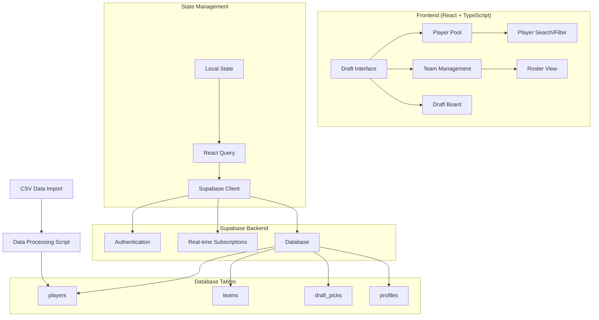

# Design Document

## Overview

The production-ready Renegades NBA Fantasy Draft application will transform the current prototype into a robust, real-time drafting platform. The design leverages the existing React + TypeScript + SHADCN UI foundation with Supabase as the backend, replacing mock data with real NBA player statistics and implementing production-level features for reliability and user experience.

## Architecture

### High-Level Architecture



### Component Architecture

The application follows a modular component structure with clear separation of concerns:

- **Pages**: Route-level components (Index, Draft, Auth, Admin)
- **Components**: Reusable UI components with SHADCN integration
- **Hooks**: Custom hooks for data fetching and state management
- **Services**: API interaction layers for Supabase operations

## Components and Interfaces

### Core Components Enhancement

#### 1. PlayerPool Component
- **Enhanced Filtering**: Position, team, availability status, statistical ranges
- **Advanced Search**: Name, team, position with debounced input
- **Sorting Options**: By rank, points, position, alphabetical
- **Performance Optimization**: Virtualized scrolling for large datasets
- **Real-time Updates**: Subscription to draft pick changes

#### 2. DraftBoard Component
- **Live Updates**: Real-time pick notifications via Supabase subscriptions
- **Visual Indicators**: Current pick highlighting, team color coding
- **Pick History**: Expandable view of completed picks with player details
- **Mobile Optimization**: Responsive grid layout for different screen sizes

#### 3. TeamRoster Component
- **Position Grouping**: Players organized by position (PG, SG, SF, PF, C)
- **Statistics Display**: Key stats for each drafted player
- **Roster Analysis**: Team strength indicators and position needs
- **Export Functionality**: Roster summary export options

#### 4. MakePickDialog Component
- **Player Confirmation**: Detailed player information before pick confirmation
- **Pick Validation**: Ensure pick is valid and team's turn
- **Success Feedback**: Toast notifications and visual confirmations
- **Error Handling**: Clear error messages for invalid picks

### New Components

#### 1. PlayerImportAdmin Component
- **CSV Upload Interface**: Drag-and-drop or file selection
- **Data Preview**: Show parsed data before import
- **Field Mapping**: Map CSV columns to database fields
- **Import Progress**: Progress indicator and error reporting
- **Data Validation**: Check for required fields and data integrity

#### 2. RealTimeStatus Component
- **Connection Status**: Show real-time connection health
- **Active Users**: Display currently connected draft participants
- **Draft Progress**: Overall draft completion percentage
- **System Notifications**: Important draft updates and announcements

## Data Models

### Enhanced Player Model

The existing Supabase `players` table schema aligns well with the CSV data. Here's the mapping:

```typescript
interface PlayerData {
  // CSV Column -> Database Field
  rank: number;           // Rank -> rank
  overall_rank: number;   // Overall -> overall_rank  
  conference_rank: number; // Conference -> conference_rank
  regional_rank: number;  // Regional -> regional_rank
  name: string;          // Player -> name
  position: string;      // Position -> position
  age: number;           // Age -> age
  nba_team: string;      // Team -> nba_team
  games_played: number;  // GP -> games_played
  minutes_per_game: number; // MPG -> minutes_per_game
  field_goals_made: number; // FGM -> field_goals_made
  field_goal_percentage: number; // FG% -> field_goal_percentage
  free_throw_percentage: number; // FT% -> free_throw_percentage
  three_pointers_made: number; // 3PM -> three_pointers_made
  three_point_percentage: number; // 3P% -> three_point_percentage
  points: number;        // PTS -> points
  total_rebounds: number; // TREB -> total_rebounds
  assists: number;       // AST -> assists
  steals: number;        // STL -> steals
  blocks: number;        // BLK -> blocks
  turnovers: number;     // TO -> turnovers
  double_doubles: number; // DD -> double_doubles
  total_score: number;   // Total -> total_score
}
```

### Draft State Management

```typescript
interface DraftState {
  currentPickIndex: number;
  draftPicks: DraftPick[];
  availablePlayers: Player[];
  teams: Team[];
  draftSettings: {
    roundCount: number;
    teamCount: number;
    pickTimeLimit?: number;
  };
}
```

## Error Handling

### Client-Side Error Handling

1. **Network Errors**: Retry logic with exponential backoff
2. **Authentication Errors**: Automatic redirect to login with return URL
3. **Validation Errors**: Form-level validation with clear error messages
4. **Real-time Connection Errors**: Graceful degradation with manual refresh options

### Server-Side Error Handling

1. **Database Constraints**: Handle unique constraint violations gracefully
2. **Permission Errors**: Clear messaging for unauthorized actions
3. **Data Integrity**: Validation at database level with proper error responses
4. **Rate Limiting**: Implement reasonable limits on API calls

### Error Recovery Strategies

- **Optimistic Updates**: Show immediate UI feedback, rollback on failure
- **Offline Support**: Cache critical data for offline viewing
- **Conflict Resolution**: Handle concurrent draft picks with proper messaging
- **Data Synchronization**: Automatic sync when connection is restored

## Testing Strategy

### Unit Testing
- **Component Testing**: React Testing Library for all UI components
- **Hook Testing**: Custom hooks with mock Supabase client
- **Utility Functions**: Data transformation and validation functions
- **Service Layer**: API interaction functions with mocked responses

### Integration Testing
- **Database Operations**: Test CRUD operations with test database
- **Authentication Flow**: Complete auth workflow testing
- **Real-time Features**: WebSocket connection and subscription testing
- **Data Import**: CSV processing and database insertion testing

### End-to-End Testing
- **Draft Flow**: Complete draft process from start to finish
- **Multi-user Scenarios**: Concurrent user interactions
- **Mobile Responsiveness**: Cross-device functionality testing
- **Performance Testing**: Load testing with realistic data volumes

## Performance Optimizations

### Frontend Optimizations
- **Code Splitting**: Route-based code splitting for faster initial loads
- **Memoization**: React.memo and useMemo for expensive computations
- **Virtual Scrolling**: For large player lists and draft boards
- **Image Optimization**: Lazy loading and proper sizing for player photos

### Backend Optimizations
- **Database Indexing**: Proper indexes on frequently queried fields
- **Query Optimization**: Efficient Supabase queries with proper filtering
- **Caching Strategy**: Client-side caching with React Query
- **Real-time Efficiency**: Targeted subscriptions to minimize data transfer

### Data Loading Strategy
- **Progressive Loading**: Load critical data first, then enhance with details
- **Prefetching**: Anticipate user actions and preload relevant data
- **Background Sync**: Update non-critical data in the background
- **Pagination**: Implement pagination for large datasets

## Security Considerations

### Authentication & Authorization
- **Row Level Security**: Supabase RLS policies for data access control
- **Team-based Permissions**: Users can only make picks for their assigned team
- **Admin Controls**: Separate admin interface with elevated permissions
- **Session Management**: Proper session handling and timeout

### Data Protection
- **Input Validation**: Sanitize all user inputs
- **SQL Injection Prevention**: Use parameterized queries through Supabase
- **XSS Protection**: Proper output encoding and CSP headers
- **Rate Limiting**: Prevent abuse of API endpoints

## Deployment Strategy

### Environment Configuration
- **Development**: Local development with Supabase local instance
- **Staging**: Staging environment for testing with production-like data
- **Production**: Optimized build with proper environment variables
- **Environment Variables**: Secure handling of API keys and configuration

### Build Optimization
- **Bundle Analysis**: Regular analysis of bundle size and optimization
- **Asset Optimization**: Minification and compression of static assets
- **CDN Integration**: Serve static assets from CDN for better performance
- **Progressive Web App**: PWA features for better mobile experience

### Monitoring & Analytics
- **Error Tracking**: Implement error tracking for production issues
- **Performance Monitoring**: Track key performance metrics
- **User Analytics**: Understanding user behavior and feature usage
- **Database Monitoring**: Track query performance and usage patterns