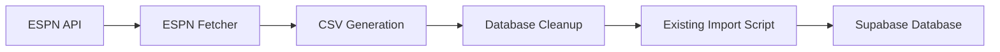

# ESPN NBA Stats Synchronization System

## Overview

This system automatically synchronizes NBA player statistics from your ESPN fantasy basketball league with your Renegades Draft application. It fetches real-time data from ESPN, generates updated CSV files, and integrates with your existing player import workflow.

## 🚀 Quick Start

### 1. Environment Setup
```bash
# Install Python dependencies
python setup_env.py

# Or manually install with pip
pip install -r requirements.txt
```

### 2. Configure ESPN Credentials
Edit `espn_credentials.json`:
```json
{
  "league_id": "your_league_id",
  "year": 2025,
  "swid": "{your_swid_cookie}",
  "espn_s2": "your_espn_s2_token"
}
```

### 3. Run Initial Sync
```bash
# Test run (no changes made)
python sync_espn_data.py --dry-run

# Production run
python sync_espn_data.py
```

## 📁 File Structure

```
/your-project/
├── espn_credentials.json      # ESPN API credentials
├── league_config.json         # League configuration
├── requirements.txt           # Python dependencies
├── setup_env.py              # Environment setup script
├── espn_data_fetcher.py      # Main ESPN data fetcher
├── db_cleanup.py             # Database cleanup script
├── sync_espn_data.py         # Master orchestration script
├── schedule_sync.bat         # Windows scheduler script
├── nba_player_stats.csv      # Generated stats CSV
├── backups/                  # CSV backup files
├── logs/                     # Execution logs
└── temp/                     # Temporary files
```

## 🔧 Configuration

### ESPN Credentials (`espn_credentials.json`)
- **league_id**: Your ESPN league ID (found in the league URL)
- **year**: Current season year
- **swid**: Your ESPN SWID cookie (see instructions below)
- **espn_s2**: Your ESPN_S2 cookie (see instructions below)

### League Configuration (`league_config.json`)
- **csv_output_path**: Path where CSV will be generated
- **backup_old_csv**: Whether to backup existing CSV files
- **cleanup_mode**: "archive" or "delete" for player cleanup
- **schedule**: Cron-style schedule for automated runs
- **max_retry_attempts**: Number of retries on failures
- **timeout_seconds**: Timeout for API calls

## 🎯 How It Works

### 1. Data Flow


### 2. Process Steps
1. **ESPN Data Fetch**: Connect to ESPN API using your league credentials
2. **Stats Extraction**: Retrieve all players and their season statistics
3. **CSV Generation**: Format data to match your existing CSV structure
4. **Database Sync**: Compare with current database and remove non-ESPN players
5. **Import Process**: Use existing import script to update database

### 3. Rotisserie Categories
The system maps ESPN stats to standard roto categories:
- **PTS**: Points
- **FGM**: Field Goals Made
- **FG%**: Field Goal Percentage
- **FT%**: Free Throw Percentage
- **3PM**: Three Pointers Made
- **3P%**: Three Point Percentage
- **REB**: Total Rebounds
- **AST**: Assists
- **STL**: Steals
- **BLK**: Blocks
- **TO**: Turnovers

## 📋 Getting ESPN Credentials

### Method 1: Browser Developer Tools
1. Log into ESPN Fantasy Basketball
2. Open browser Developer Tools (F12)
3. Navigate to Application/Storage → Cookies
4. Look for `espn.com` domain cookies:
   - **SWID**: Your ESPN user ID
   - **ESPN_S2**: Your session token

### Method 2: Browser Extensions
Use extensions like "Cookie Editor" for Chrome/Firefox to extract the cookies.

### Method 3: Console Script
Open browser console and run:
```javascript
// Copy and paste this in your browser console on ESPN site
document.cookie.split(';').filter(c => c.includes('SWID') || c.includes('ESPN_S2'))
```

## 🛠️ Usage Commands

### One-time Sync
```bash
# Full sync with all steps
python sync_espn_data.py

# Test without making changes
python sync_espn_data.py --dry-run

# Skip specific steps
python sync_espn_data.py --skip-fetch    # Skip ESPN API call
python sync_espn_data.py --skip-cleanup  # Skip database cleanup
python sync_espn_data.py --skip-import   # Skip CSV import
```

### Individual Components
```bash
# Only fetch ESPN data
python espn_data_fetcher.py

# Only cleanup database
python db_cleanup.py --dry-run

# Test import process
cd renegades-draft-central
node scripts/import-players.js
```

### Setup and Testing
```bash
# Environment setup
python setup_env.py

# Test ESP connection
python setup_env.py (includes connection test)

# Test all components separately
python espn_data_fetcher.py --dry-run
python db_cleanup.py --dry-run
```

## 🔄 Automation

### Windows Task Scheduler
1. Open Windows Task Scheduler
2. Create new task → "Create Basic Task"
3. Set name: "ESPN NBA Stats Sync"
4. Trigger: Daily at 6:00 AM (weekdays)
5. Action: Start a program
6. Program: `schedule_sync.bat`
7. Working directory: Your project root path

### Linux/Mac (Cron)
```bash
# Add to crontab (crontab -e)
0 6 * * 1-5 cd /path/to/project && python sync_espn_data.py
```

## 🔍 Troubleshooting

### Common Issues

**"Failed to connect to ESPN"**
- Verify ESPN credentials are correct
- Check if your ESPN session is still active
- Try re-extracting cookies from ESPN website

**"CSV file not found"**
- Ensure the path in `league_config.json` is correct
- Check file permissions
- Verify the script has write access to output directory

**"Import process failed"**
- Check Node.js and existing import script are working
- Verify Supabase credentials in import script
- Check database connectivity

### Logs and Debugging
```bash
# Enable verbose logging
python sync_espn_data.py --dry-run --verbose

# Check application logs
tail -f logs/espn_sync.log

# Test ESP connection only
python setup_env.py
```

### Manual Testing
```bash
# Test each component individually
python espn_data_fetcher.py --dry-run --verbose
python db_cleanup.py --dry-run --verbose
cd renegades-draft-central && node scripts/import-players.js --dry-run
```

## 📊 Database Impact

### Player Management
- **ESPN Players**: Automatically included with latest stats
- **Non-ESPN Players**: Removed from database (configurable)
- **Stats Updates**: Real-time season statistics
- **Rookie Detection**: Based on player experience

### Cleanup Modes
- **Archive**: Mark non-ESPN players as inactive
- **Delete**: Permanently remove non-ESPN players
- **Skip**: Keep all existing players

## 🔐 Security Notes

- Store ESPN credentials securely
- Use environment variables for sensitive data in production
- Regularly rotate ESPN tokens (they may expire)
- Keep backup CSVs for recovery
- Monitor sync logs for unusual activity

## 📈 Monitoring

The system provides comprehensive logging:
- **Sync Results**: Success/failure status for each step
- **API Calls**: ESPN connection and data retrieval status
- **Database Changes**: Players added/removed counts
- **Error Details**: Detailed error messages for troubleshooting

## 🚀 Benefits

✅ **Perfect League Sync**: Only players from your ESPN league
✅ **Real-time Stats**: Current season data automatically updated
✅ **Minimal Changes**: Leverages existing infrastructure
✅ **Automated**: Runs on schedule with minimal intervention
✅ **Robust**: Comprehensive error handling and recovery
✅ **Cost Effective**: No additional API infrastructure needed

## 🎯 Success Criteria

- [ ] Daily CSV updates with ESPN stats
- [ ] Database contains only ESPN league players
- [ ] All rotisserie categories populated correctly
- [ ] Import process works seamlessly
- [ ] Automated scheduling operational
- [ ] Error monitoring and alerts functional

## 📞 Support

For issues with:
- **ESPN API**: Check ESPN service status and credentials
- **Database**: Verify Supabase connectivity and permissions
- **Scripts**: Review logs in `/logs` directory
- **Automation**: Test manual runs before scheduling

## 🔄 Version History

- **v1.0**: Initial implementation with ESP API integration
- Basic sync functionality
- Database cleanup and import integration
- Windows automation support