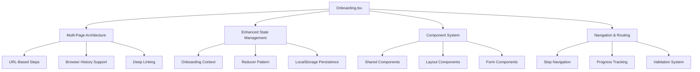

# Onboarding.tsx Comprehensive Refactoring Plan

## Overview

This document outlines a comprehensive refactoring plan for the Onboarding.tsx component to improve code quality, user experience, performance, and maintainability while aligning with the existing application architecture.

## Current Issues Identified

### Code Quality Problems
- Hard-coded placeholder text ("Can't remember", "Not too much")
- Mixed concerns in a single large component
- No TypeScript interfaces for better type safety
- Poor error handling and user feedback
- No validation logic for step progression

### Performance Issues
- No memoization for expensive operations
- Re-renders on every step change
- No lazy loading of child components
- Inefficient state management

### User Experience Problems
- No progress persistence (lost on page refresh)
- Poor mobile experience
- Limited accessibility features
- No loading states for async operations
- No proper error recovery mechanisms

## Proposed Solution Architecture

### Multi-Page Enhancement Integration

### Key Integration Points

#### Existing Hooks to Leverage
- `useIsMobile()` - Mobile responsiveness
- `useToast()` - Better user feedback
- `useTeams()` - Dynamic team data
- `useDraftState()` - Draft settings and configuration
- `useAuth()` - Enhanced authentication state
- `usePerformanceMonitoring()` - Performance tracking

#### Supabase Services Integration
- Type-safe database operations
- Real-time subscriptions (if needed)
- Error handling patterns
- Service layer architecture

## Implementation Phases

### Phase 1: Foundation (High Priority)
1. **Create TypeScript Interfaces**
   - OnboardingStep interface
   - OnboardingState interface
   - FeatureCard interface
   - Error handling types

2. **Integrate Existing Hooks**
   - useIsMobile for responsive design
   - useToast for user feedback
   - useDraftState for dynamic configuration
   - useTeams for dynamic data
   - useAuth for enhanced auth state

3. **Create Onboarding Context**
   - Centralized state management
   - Reducer pattern for predictable updates
   - LocalStorage integration for persistence

### Phase 2: Component Architecture (High Priority)
1. **Extract Reusable Components**
   - ProgressIndicator with accessibility features
   - FeatureCard with responsive design
   - Sidebar with dynamic league info
   - LoadingState for consistent loading UI
   - ErrorBoundary for comprehensive error handling

2. **Implement URL-Based Step Management**
   - React Router integration
   - Browser back/forward support
   - Deep linking to specific steps
   - SEO-friendly URLs

### Phase 3: Enhanced Features (Medium Priority)
1. **Step Validation & Progress**
   - Validation before step progression
   - Progress persistence using localStorage
   - Step completion tracking
   - Navigation guards

2. **Error Handling & Loading States**
   - Comprehensive error boundaries
   - Loading states for all async operations
   - User-friendly error messages with useToast
   - Retry mechanisms for failed operations

### Phase 4: Optimization & Polish (Medium Priority)
1. **Mobile & Accessibility Improvements**
   - Responsive grid layouts using useIsMobile
   - Touch-friendly button sizes and interactions
   - ARIA labels and keyboard navigation
   - Screen reader support
   - Focus management

2. **Performance Optimizations**
   - Memoize expensive computations with useMemo
   - Implement lazy loading for child components
   - Optimize re-renders with React.memo
   - Proper dependency arrays in useEffect

### Phase 5: Dynamic Data & Testing (Low Priority)
1. **Dynamic Data Integration**
   - Replace hardcoded values with useDraftState data
   - Use useTeams for dynamic team information
   - Add proper data validation and fallbacks
   - Real-time data updates

2. **Testing & Documentation**
   - Comprehensive testing setup
   - Component testing with React Testing Library
   - Integration tests for user flows
   - Performance testing
   - Accessibility testing

## Expected Improvements

### Maintainability
- Modular, testable components with clear separation of concerns
- TypeScript interfaces for better type safety
- Consistent error handling patterns
- Reusable component library

### Performance
- Reduced re-renders through memoization
- Lazy loading of child components
- Optimized state management
- Better memory usage

### User Experience
- Seamless multi-step experience with browser navigation
- Better mobile experience with responsive design
- Progress persistence and recovery
- Enhanced error handling and user feedback
- Accessible interface with proper ARIA support

### Code Quality
- Modern React patterns and best practices
- Comprehensive error handling
- Integration with existing architecture
- Future-proof scalable design

## Success Metrics

- **Performance**: Reduced bundle size, faster loading times
- **User Experience**: Higher completion rates, fewer errors, better mobile experience
- **Maintainability**: Easier to add new steps, modify existing ones
- **Accessibility**: WCAG compliance across all steps
- **Code Quality**: Type safety, comprehensive testing, consistent patterns

## Implementation Timeline

- **Phase 1**: 2-3 days (Foundation)
- **Phase 2**: 3-4 days (Component Architecture)
- **Phase 3**: 2-3 days (Enhanced Features)
- **Phase 4**: 2-3 days (Optimization)
- **Phase 5**: 2-3 days (Testing & Polish)

Total estimated time: 11-16 days

## Risk Mitigation

1. **Incremental Implementation**: Each phase builds on the previous one
2. **Feature Flags**: Ability to roll back changes if needed
3. **Comprehensive Testing**: Ensure no regression in existing functionality
4. **User Feedback**: Regular testing and feedback collection
5. **Documentation**: Detailed documentation for future maintenance

## Next Steps

1. Begin implementation with Phase 1 (Foundation)
2. Regular progress updates and testing
3. User feedback integration
4. Performance monitoring and optimization
5. Final testing and deployment

This plan transforms the Onboarding component into a robust, scalable, and user-friendly experience that leverages existing architecture patterns while significantly improving quality and functionality.