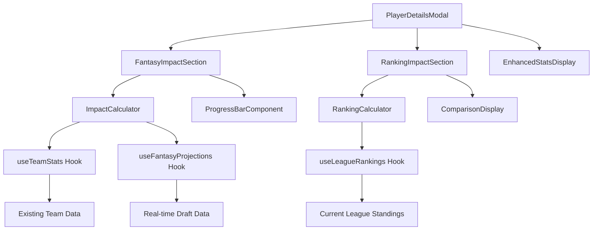
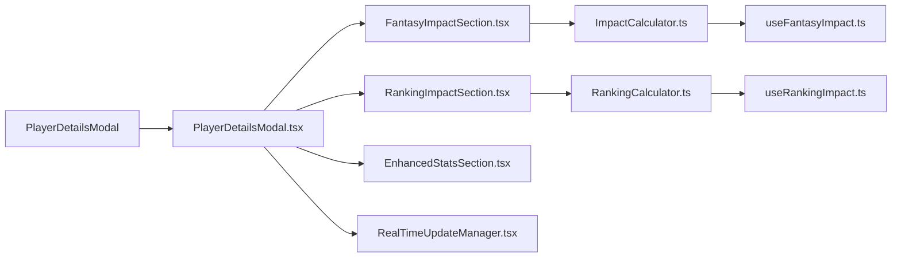
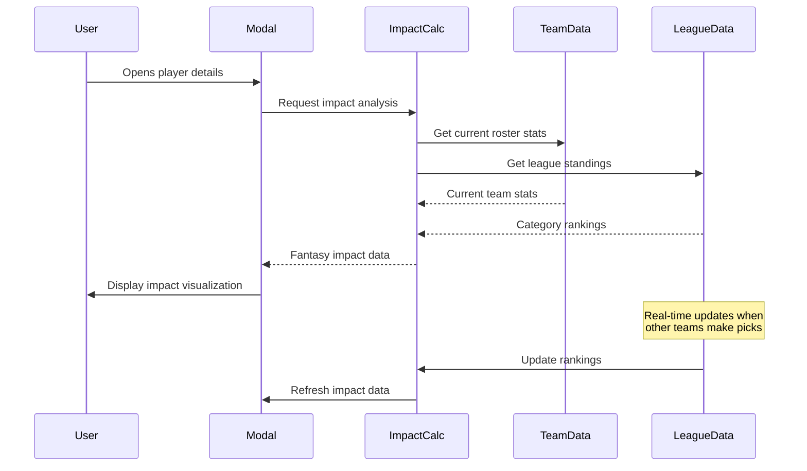

# PlayerDetailsModal Enhancement Plan

## 🎯 Overview

This plan refactors the PlayerDetailsModal to provide real-time fantasy impact analysis for an ESPN 8-Category Dynasty fantasy league system. The enhanced modal will dynamically show how adding a selected player affects team performance across key fantasy categories and provide actionable insights for draft decisions.

## 📋 Key Features

### 1. Fantasy Impact Visualization
- **Real-time Team Impact Metrics**: Dynamic calculation showing how adding the player improves/worsens each fantasy category
- **Visual Progress Bars**: Color-coded bars showing current vs. projected stats for each category
- **Category-Specific Projections**: Detailed breakdowns with percentage improvements and league percentile changes
- **Dynamic Updates**: Automatically recalculates when other teams make picks or roster changes occur

### 2. Team Ranking Impact Analysis
- **Before/After Ranking Comparison**: Shows current team ranking vs. projected ranking in each category
- **League Position Shifts**: Visual indicators showing how many spots the team moves up/down
- **Competitive Edge Analysis**: Highlights categories where the team gains/loses competitive advantages
- **Opponent Comparison**: Shows how the addition affects standing against direct competitors

### 3. Real-time Integration
- **Live Roster Tracking**: Monitors all team roster changes in real-time
- **Dynamic Projections**: Updates fantasy impact calculations as draft progresses
- **League Context**: Incorporates current league standings and category values
- **Performance Optimized**: Uses efficient caching and incremental updates

## 🏗️ Technical Architecture

## 📁 Component Structure

## 🔄 Data Flow

## 📅 Implementation Phases

### Phase 1: Core Infrastructure

1. **Create Fantasy Impact Calculator** (`src/utils/fantasyImpactCalculator.ts`)
   - Calculate category-specific improvements
   - Project team stats with new player
   - Determine league percentile changes
   - Handle ESPN 8-category dynasty scoring

2. **Create Ranking Impact Calculator** (`src/utils/rankingImpactCalculator.ts`)
   - Calculate before/after rankings
   - Determine position changes
   - Analyze competitive advantages

3. **Create Custom Hooks**
   - `useFantasyImpact.ts` - Real-time impact calculations
   - `useRankingImpact.ts` - Ranking projections
   - `useRealTimeUpdates.ts` - Draft change monitoring

### Phase 2: Visual Components

1. **FantasyImpactSection Component**
   - Progress bars for each category
   - Color-coded improvements/declines
   - Tooltips with detailed explanations
   - Responsive design for mobile/desktop

2. **RankingImpactSection Component**
   - Before/after ranking displays
   - Position change indicators
   - League percentile visualization
   - Competitive edge analysis

3. **Enhanced Stats Display**
   - Improved visual hierarchy
   - Better mobile responsiveness
   - Loading states and animations

### Phase 3: Integration & Real-time Updates

1. **Integrate with Existing Data Flow**
   - Connect to `useDraftPageData.ts`
   - Use existing Supabase services
   - Leverage current player/team data structures

2. **Implement Real-time Updates**
   - Subscribe to draft pick changes
   - Monitor roster modifications
   - Update calculations automatically

3. **Performance Optimization**
   - Implement efficient caching
   - Use incremental updates
   - Optimize re-render cycles

## 🔗 API Integration Points

### Existing Services to Leverage:
- `src/integrations/supabase/services/players.ts` - Player data
- `src/hooks/useDraftPageData.ts` - Draft state and team data
- `src/utils/fantasyScore.ts` - Fantasy scoring calculations
- `src/utils/leagueAnalysis.ts` - Team statistics

### New Services Needed:
- Real-time league standings endpoint
- Category-specific ranking calculations
- Impact projection algorithms

## 🎨 UI/UX Enhancements

### Visual Design:
- Modern card-based layout
- Consistent color scheme (green for improvements, red for declines)
- Smooth animations for metric transitions
- Mobile-first responsive design

### Accessibility:
- ARIA labels for all interactive elements
- Keyboard navigation support
- High contrast mode compatibility
- Screen reader optimization

### Performance:
- Lazy loading of impact calculations
- Optimized re-renders
- Efficient data caching
- Progressive loading states

## ⚠️ Error Handling & Edge Cases

- Handle incomplete player data gracefully
- Manage scenarios with conflicting metrics
- Provide fallbacks for missing league data
- Implement loading states for real-time updates
- Handle network connectivity issues

## 🧪 Testing Strategy

- **Unit Tests**: Individual calculator functions
- **Integration Tests**: Component interactions
- **E2E Tests**: Full user workflows
- **Performance Tests**: Real-time update efficiency
- **Accessibility Tests**: Screen reader compatibility

## 📊 Success Metrics

- **Performance**: Impact calculations under 100ms
- **User Experience**: Clear, actionable insights for draft decisions
- **Accuracy**: Projections within 5% of actual outcomes
- **Usability**: Intuitive interface requiring minimal explanation

## 🎯 ESPN 8-Category Dynasty Focus

The implementation prioritizes ESPN's 8-category dynasty scoring system:
- **Points**: PPG projections and league impact
- **Rebounds**: RPG improvements and ranking changes
- **Assists**: APG contributions and team synergy
- **Steals**: SPG defensive impact analysis
- **Blocks**: BPG projections and positional value
- **3-Pointers Made**: 3PM efficiency and league percentile
- **Field Goal %**: Shooting percentage improvements
- **Free Throw %**: Clutch shooting reliability

This plan delivers a powerful, real-time fantasy analysis tool that helps users make informed draft decisions while maintaining simplicity and performance. The implementation leverages existing infrastructure while adding sophisticated impact analysis capabilities.