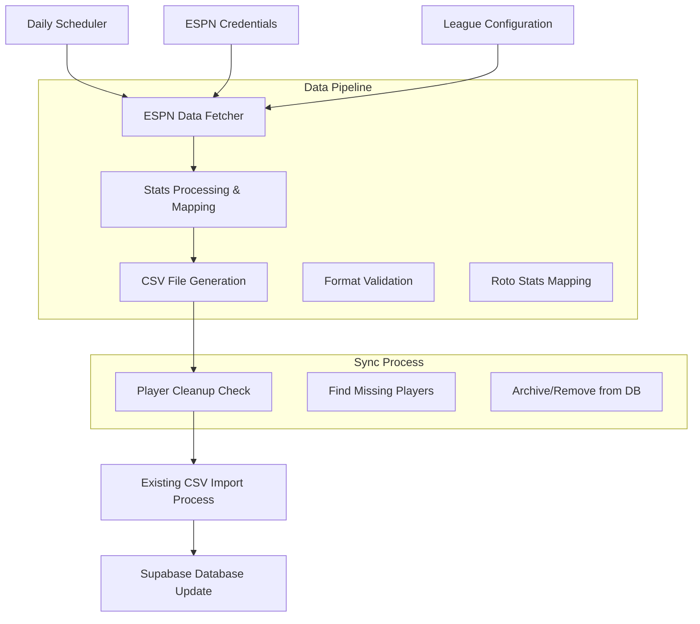

# ESPN NBA Stats Integration Plan

## Overview
Integrate ESPN API to dynamically update the CSV file used for NBA player stats in your Renegades Draft league application. This approach leverages your existing CSV import infrastructure while providing real-time data synchronization with your ESPN league.

## Goals
- **Update existing CSV file** with current NBA stats from ESPN API
- **Remove irrelevant players** from the database that aren't in your ESPN league
- **Maintain existing workflow** without major infrastructure changes
- **Automate daily updates** for fresh stats

## Architecture



## Technical Implementation

### 1. Core Components

**ESPN Data Fetcher (Python Script)**
- Uses `espn-api` library to connect to your league
- Fetches player stats for all players in your league
- Maps ESPN stats to your CSV format

**Player Synchronization**
- Compares ESPN player list with current database
- Identifies players to remove (not in ESPN league)
- Archives or removes irrelevant players

**Automated Schedule**
- Daily runs during off-peak hours
- Error handling and retry logic
- Email notifications for failures

### 2. ESPN Stats Mapping

**Required Roto Categories:**
- Scoring (PTS)
- Field Goals Made (FGM)
- Field Goal % (FG%)
- Free Throw % (FT%)
- Three Pointers Made (3PM)
- Three Point % (3P%)
- Rebounds (REB)
- Assists (AST)
- Steals (STL)
- Blocks (BLK)
- Turnovers (TO)
- Double Doubles (DD)
- Triple Doubles (TD)
- Actual Points (PTS)

### 3. Implementation Phases

#### Phase 1: Setup & Testing (Week 1)
- Install ESPN API library
- Test ESPN credentials and league access
- Verify data format compatibility
- Manual CSV generation test

#### Phase 2: Script Development (Weeks 2-3)
- Build ESPN data fetcher script
- Implement stats mapping and CSV generation
- Add player cleanup logic
- Comprehensive error handling

#### Phase 3: Automation & Deployment (Week 4)
- Set up automated scheduling
- Deploy to production environment
- Monitor initial runs and data quality
- Add alerting and monitoring

### 4. File Structure

```
/
├── espn_data_fetcher.py          # Main data fetching script
├── requirements.txt              # Python dependencies
├── config/
│   ├── espn_credentials.json     # ESPN API credentials
│   └── league_config.json        # League-specific settings
├── scripts/
│   ├── fetch_espn_data.py        # Data fetching module
│   ├── csv_generator.py          # CSV generation module
│   └── db_cleanup.py             # Database cleanup module
└── logs/                        # Execution logs
```

### 5. Configuration Files

**ESPN Credentials (espn_credentials.json)**
```json
{
  "league_id": "your_league_id",
  "year": 2025,
  "swid": "{your_swid}",
  "espn_s2": "your_espn_s2_token"
}
```

**League Config (league_config.json)**
```json
{
  "csv_output_path": "nba_player_stats.csv",
  "backup_old_csv": true,
  "cleanup_mode": "archive",
  "schedule": "0 6 * * 1-5"
}
```

### 6. Data Flow

1. **Fetch**: Connect to ESPN API using league credentials
2. **Extract**: Get all players and their season stats
3. **Map**: Transform ESPN stats to CSV roto format
4. **Generate**: Create new CSV file with fresh data
5. **Compare**: Check against current database players
6. **Clean**: Archive/remove players not in ESPN data
7. **Import**: Use existing CSV import process to update database

### 7. Error Handling & Reliability

- **API Failures**: Retry logic with exponential backoff
- **Data Validation**: Schema validation for fetched data
- **Database Safety**: Transactional updates with rollback capability
- **Monitoring**: Email alerts for sync failures or data anomalies
- **Fallbacks**: Archive previous CSV on failures

### 8. Security Considerations

- **Credential Management**: Secure storage of ESPN tokens
- **API Limits**: Respectful rate limiting to avoid bans
- **Data Encryption**: Protect sensitive configuration files
- **Access Control**: Restrict script execution to authorized users

## Benefits

✅ **Perfect League Sync** - Only players in your ESPN league
✅ **Minimal Code Changes** - Leverages existing infrastructure
✅ **Real-time Data** - Current season stats automatically updated
✅ **Cost Effective** - No additional API infrastructure needed
✅ **Easy Maintenance** - Single script, clear data flow
✅ **Reliable** - Comprehensive error handling and monitoring

## Success Criteria

- [ ] CSV file updated daily with ESPN stats
- [ ] Only ESPN league players remain in database
- [ ] All roto categories populated correctly
- [ ] Import process continues to work seamlessly
- [ ] Automated scheduling operational
- [ ] Error monitoring and alerting functional

## Next Steps

After this plan is approved, we will:
1. Set up development environment
2. Install ESPN API dependencies
3. Test ESPN API connectivity
4. Build and test the data pipeline
5. Implement automated scheduling
6. Deploy and monitor production usage

## Dependencies

- Python 3.8+
- espn-api library (`pip install espn-api`)
- Supabase Python client
- Cron scheduler or similar automation tool
- Email service for notifications