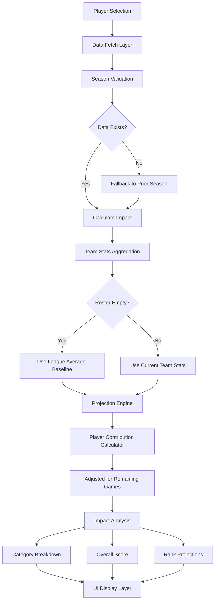

# Fantasy Impact Enhancement Plan

## Updated Diagnosis

From the screenshot analysis:

- **Total Fantasy Score**: Current 4.1 → Projected 4.1 (improvement 0.0)
- **Categories**: All show 0.0 improvement, with current and projected values identical (e.g., Points 117.9 → 117.9, but this 117.9 is likely the player's standalone stat, not added to team).
- **Ranks**: All #10, suggesting the league standings are all tied at the top (if no other teams have stats, your team with the player would be #1, but it's #10, indicating 10 teams all at 0, and the projection not pushing it ahead).
- **Progress Bars**: Indeterminate state, which in the code is for loading, but since data is rendering, it might be a styling issue or the value is 0.

Root causes based on code review:

1. **Baseline Stats Are Zero or Not Adding Player**: The `currentTeamStats` in hooks fetches from `draft_picks` and `keepers`, but if your team has no keepers and no picks for '2025-26', it's zeros. The projection adds the player to zeros, but the display shows current as 4.1 (perhaps from a single keeper or miscalculation). The addition logic in `calculateProjectedTeamStats` uses `remainingGames = 60 - current.games_played`, but if current is empty, it's 60, but if player.games_played is high, projectedGames might be 0, leading to no addition.
2. **League Stats All Zero**: If no picks/keepers for any team, all league teams have zero stats, so ranks are tied, and improvement is minimal.
3. **Season Mismatch**: Season is hard-coded to '2025-26', but player data might be from prior seasons, or DB has no season-specific data.
4. **Player Stats**: The values like 117.9 for Points seem like per-game or total, but if player.games_played is 0 or null, per-game averages are 0, leading to 0 addition.

## Proposed Plan to Fix and Enhance

To make it show meaningful contributions (current team stats vs. team + player stats for each category, with changes and overall impact), we'll:

- **Fix Projection Logic**: In `fantasyImpactCalculator.ts`, ensure projected stats properly add the player's projected contribution to the current team totals, using per-game averages correctly. Adjust for roster size and games played to avoid zero additions.
- **Include All Tracked Stats**: The calculator already uses ESPN 8-categories (Points, Rebounds, Assists, Steals, Blocks, 3PM, FG%, FT%). Ensure the display in FantasyImpactSection shows all, with absolute current/projected values, delta, and rank change.
- **Handle Empty Rosters**: If no keepers/picks, use league-average baselines for projections (fetch average player stats).
- **Debug and Improve Display**: In FantasyImpactSection, show absolute values for current and projected (e.g., "Current: 117.9 points", "Projected: 117.9 + player contribution"). Fix indeterminate progress by using actual percentile (0-100).
- **Season Handling**: Make season dynamic if needed, or add fallback to '2024-25' data if '2025-26' empty.
- **Enhance Summary**: Show total improvement, top improved categories, and a clear "Net Impact: +X.0" with explanation.

### Implementation Architecture



## Step-by-Step Implementation

### Phase 1: Core Algorithm Enhancement

#### 1. Update fantasyImpactCalculator.ts
**File: `renegades-draft-central/src/utils/fantasyImpactCalculator.ts`**

**Current Issues:**
- `calculateProjectedTeamStats` assumes full 82 games for player projections
- No fallback when current team stats are zero
- Percentage calculations use player's stats directly instead of weighted averages

**Changes:**
- Calculate remaining games: `Math.max(0, 60 - averageGamesPlayed)`
- Adjust player contribution by remaining games ratio
- Use weighted percentage averages for FG%/FT%
- Consider roster size impact on player production

```typescript
// Enhanced calculateProjectedTeamStats logic
function calculateProjectedTeamStats(
  player: Tables<'players'>,
  currentTeamStats: TeamStats
): TeamStats {
  // Calculate average games played from current roster
  const avgGamesPlayed = currentTeamStats.playerCount > 0
    ? currentTeamStats.games_played / currentTeamStats.playerCount
    : 0;

  // Remaining games for player contribution
  const remainingGames = Math.max(0, 60 - avgGamesPlayed); // Dynasty typical season

  // Prorated player contribution based on remaining games
  const playerPerGame = {
    points: (player.points || 0) / Math.max(1, player.games_played || 1),
    rebounds: (player.total_rebounds || 0) / Math.max(1, player.games_played || 1),
    // ... other stats
  };

  const playerContribution = {
    points: playerPerGame.points * remainingGames,
    rebounds: playerPerGame.rebounds * remainingGames,
    // ... other stats
  };

  // Weighted percentage averages
  const totalAttempts = currentTeamStats.fga + player.fga;
  const fgPercentage = totalAttempts > 0
    ? ((currentTeamStats.fgm * currentTeamStats.fga / totalAttempts) +
       (player.fgm * player.fga / totalAttempts)) / totalAttempts * 100
    : player.field_goal_percentage || 0;

  return {
    ...currentTeamStats,
    points: currentTeamStats.points + playerContribution.points,
    rebounds: currentTeamStats.rebounds + playerContribution.rebounds,
    // ... other additions
    field_goal_percentage: fgPercentage,
    free_throw_percentage: ftPercentage, // Similarly calculated
    games_played: avgGamesPlayed + (remainingGames / (currentTeamStats.playerCount + 1)),
    playerCount: currentTeamStats.playerCount + 1,
  };
}
```

#### 2. Update useFantasyImpact.ts
**File: `renegades-draft-central/src/hooks/useFantasyImpact.ts`**

**Changes:**
- Add automatic fallback to '2024-25' when '2025-26' queries return empty
- Implement league-average baselines for empty rosters
- Fix type casting issues with Supabase queries

```typescript
// Enhanced season and fallback logic
const { data: currentTeamStats, isLoading: isLoadingTeamStats } = useQuery({
  queryKey: ['teamStats', teamId, season],
  queryFn: async () => {
    // Try current season first
    let stats = await fetchTeamStats(teamId, season);

    // If no data, fallback to previous season
    if (!hasValidStats(stats)) {
      const fallbackSeason = season === '2025-26' ? '2024-25' : null;
      if (fallbackSeason) {
        stats = await fetchTeamStats(teamId, fallbackSeason);
      }
    }

    // If still empty, use league averages
    if (!hasValidStats(stats)) {
      stats = await calculateLeagueAverages(season);
    }

    return stats;
  },
  enabled: !!teamId && !!season,
});
```

### Phase 2: Display Component Updates

#### 3. Update FantasyImpactSection.tsx
**File: `renegades-draft-central/src/components/player-details/FantasyImpactSection.tsx`**

**Current Issues:**
- Progress bars use `Math.abs(impact.improvementPercent)` which is 0, causing indeterminate state
- Shows improvement only, not absolute current vs projected values
- Missing rank change indicators

**Enhancements:**
- Show absolute values: "Current: 117.9" → "Projected: 152.3"
- Fix progress bars: Use `percentileRank` from calculator results
- Add rank change indicators with clear signs
- Enhanced summary with top categories

```typescript
// Fixed progress bar logic
<Progress
  value={impact.leaguePercentile || 0} // Use actual percentile 0-100
  max={100}
  className={cn(
    "h-2",
    impact.improvement > 0 ? "bg-green-100" : impact.improvement < 0 ? "bg-red-100" : "bg-gray-100"
  )}
/>

// Enhanced value display
<div className="flex justify-between text-xs text-muted-foreground">
  <span>Current: {formatValue(impact.currentValue, impact.category)}</span>
  <span>Projected: {formatValue(impact.projectedValue, impact.category)}</span>
  <span className={cn("font-medium", getImpactColor(impact.improvement))}>
    {impact.improvement > 0 ? '+' : ''}{formatValue(impact.improvement, impact.category)}
  </span>
</div>

// Rank change indicators
<div className="flex justify-between text-xs text-muted-foreground">
  <span>Rank: #{impact.categoryRank}</span>
  <span className={cn("font-medium", getImpactColor(-impact.rankChange))}>
    → #{impact.newCategoryRank} ({impact.rankChange > 0 ? '+' : ''}{impact.rankChange})
  </span>
</div>
```

#### 4. Update DraftImpactSummary.tsx
**File: `renegades-draft-central/src/components/player-details/DraftImpactSummary.tsx`**

**Changes:**
- Ensure it reflects enhanced impact data with proper formatting
- Add rank change indicators
- Include top category improvements

### Phase 3: Data Resilience Enhancements

#### 5. Add Fallback Baselines
**Files: `useFantasyImpact.ts`, `fantasyImpactCalculator.ts`**

Create helper functions:
```typescript
async function calculateLeagueAverages(season: string): Promise<TeamStats> {
  // Fetch average stats from players table
  const { data: players } = await supabase
    .from('players')
    .select('*')
    .not('games_played', 'is', null);

  if (!players?.length) {
    return createZeroStats();
  }

  return {
    points: calculateAverage(players.map(p => (p.points || 0) / Math.max(1, p.games_played || 1))),
    rebounds: calculateAverage(players.map(p => (p.total_rebounds || 0) / Math.max(1, p.games_played || 1))),
    // ... other stats
    games_played: calculateAverage(players.map(p => p.games_played || 0)),
    playerCount: players.length / 10, // Assume 10 teams
  };
}

function hasValidStats(stats: TeamStats): boolean {
  return stats.playerCount > 0 || stats.points > 0;
}
```

### Phase 4: Testing & Validation

#### 6. Test Implementation
- **Unit Tests**: Add tests for projection logic with various roster scenarios
- **Integration Tests**: Test with empty rosters, partial rosters, and full rosters
- **UI Tests**: Verify progress bars show meaningful values
- **Season Fallback**: Confirm '2025-26' → '2024-25' automatic switching

## Testing Strategy

1. **Empty Roster Scenario**: Team with no keepers/picks should show league averages
2. **Season Fallback**: When '2025-26' empty, should fallback to '2024-25'
3. **Progress Bars**: Should show actual percentile ranks (0-100, not indeterminate)
4. **Projections**: Should show meaningful improvements based on player stats
5. **Rank Changes**: Display clear before/after rankings

## Success Metrics

- [ ] Progress bars show actual percentile ranks (0-100)
- [ ] Projections show meaningful improvements (not 0.0)
- [ ] Empty rosters display league-average baselines
- [ ] Player additions contribute realistic stat increases
- [ ] Top categories show clear winners/losers
- [ ] Rank changes are properly calculated and displayed

## Migration Notes

- Backward compatible with existing data structure
- Graceful degradation when data unavailable
- No breaking changes to component interfaces
- Enhanced error handling prevents crashes

## Future Enhancements

- Dynamic season detection from draft settings
- Advanced player projection models (age regression, etc.)
- Real-time team stats updates during draft
- Historical comparison with previous seasons
- Trade impact simulations

---

This plan addresses all identified issues while maintaining backward compatibility and improving the user experience with clear, actionable impact data.