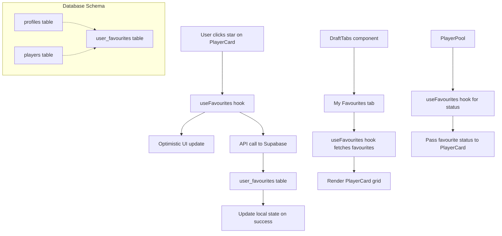

# Favourite Player Feature Implementation Plan

## 🎯 **Overview**
Add a user favourite player feature to the Renegades Draft Central application. Users can mark players as favourites for quick reference during draft sessions.

## 📋 **Requirements**
- ✅ Star icon with fill/outline states showing current favourite status
- ✅ Private user favourites (not team-shared)
- ✅ "My Favourites" section in draft interface
- ✅ Same card grid format for viewing favourites
- ✅ MVP scope: add/remove + view favourites

## 🏗️ **Architecture & Data Flow**



## 🗄️ **Database Schema**

### New Table: `user_favourites`
```sql
CREATE TABLE user_favourites (
    id UUID PRIMARY KEY DEFAULT gen_random_uuid(),
    user_id UUID NOT NULL REFERENCES profiles(user_id),
    player_id UUID NOT NULL REFERENCES players(id),
    created_at TIMESTAMP WITH TIME ZONE DEFAULT NOW(),
    UNIQUE(user_id, player_id)
);

-- Row Level Security
ALTER TABLE user_favourites ENABLE ROW LEVEL SECURITY;

CREATE POLICY "Users can only access their own favourites" ON user_favourites
  FOR ALL USING (auth.uid() = user_id);
```

## 🚀 **Implementation Phases**

### **Phase 1: Backend Infrastructure**
1. **Database Migration**: Create `user_favourites` table
2. **Supabase Types**: Update TypeScript schema
3. **API Functions**: Add, remove, get user favourites
4. **RLS Policies**: User can only access their own favourites

### **Phase 2: Frontend Logic**
5. **Custom Hook**: `useFavourites` for state management
   - Fetch user's favourite player IDs
   - Toggle favourite status with optimistic updates
   - Handle loading and error states

6. **PlayerCard Enhancement**:
   - Add star icon positioned in top-right
   - Fill state = favourited, outline = not favourited
   - Click handler for toggling
   - Prevent click propagation to avoid card selection

### **Phase 3: UI Components**
7. **PlayerPool Update**:
   - Fetch favourite status for all visible players
   - Pass favourite status to each PlayerCard
   - Add "Show Favourites Only" filter option

8. **My Favourites Section**:
   - Add tab to draft interface
   - Use existing PlayerPool component but filtered
   - Same card grid layout
   - Loading states and empty states

### **Phase 4: Polish & Error Handling**
9. **Visual Feedback**:
   - Toast notifications for actions
   - Loading spinners on buttons
   - Error states with retry options

10. **Edge Cases**:
    - Offline handling (localStorage fallback)
    - API errors with graceful degradation
    - Deleted players still in favourites

## 🧩 **Component Architecture**

```
DraftTabs
├── Pool Tab
│   └── PlayerPool
│       ├── PlayerCard (with star icon)
│       └── Filters (including "Favourites Only")
├── Analytics Tab
└── My Favourites Tab
    └── PlayerPool (favourited players only)
```

## 🔧 **Technical Decisions**

- **Optimistic Updates**: UI updates immediately, rolls back on API failure
- **State Management**: Custom hook manages favourites separately from main player state
- **Icon Positioning**: Top-right corner of PlayerCard, similar to existing badges
- **Data Synchronization**: Real-time updates via Supabase subscriptions
- **Performance**: Lazy loading and pagination for large favourite lists

## 📋 **Detailed Checklist**

- [ ] Analyze existing database schema and authentication system
- [ ] Design user_favourites table with user_id, player_id, created_at columns
- [ ] Create database migration for user_favourites table
- [ ] Update Supabase TypeScript types to include user_favourites
- [ ] Implement backend API functions for managing favourites (add, remove, get)
- [ ] Create useFavourites custom hook for managing favourite state
- [ ] Add star icon with fill/outline states to PlayerCard component
- [ ] Update PlayerPool to pass favourite status to PlayerCard components
- [ ] Create "My Favourites" tab/section in draft interface
- [ ] Implement favourite toggle functionality with optimistic updates
- [ ] Add proper error handling and loading states
- [ ] Include visual feedback for favourite actions (success/error messages)
- [ ] Add "Show Favourites Only" filter option in player pool

## 🎨 **UI/UX Considerations**

- Star icon should be visually distinct but not overwhelming
- Consistent with existing design system (colors, spacing)
- Clear visual feedback for all actions
- Intuitive interaction patterns
- Responsive design for all screen sizes

## 🧪 **Testing Strategy**

- Unit tests for custom hook functionality
- Integration tests for database operations
- End-to-end tests for favourite workflow
- Error handling and edge case testing
- Performance testing with large favourite lists

## 🚀 **Success Metrics**

- Feature usage analytics
- User engagement with favourite functionality
- Performance impact assessment
- Error rate monitoring