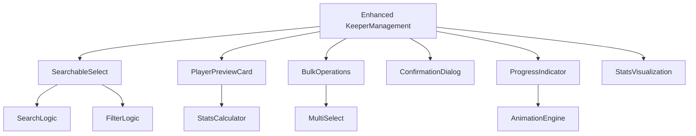
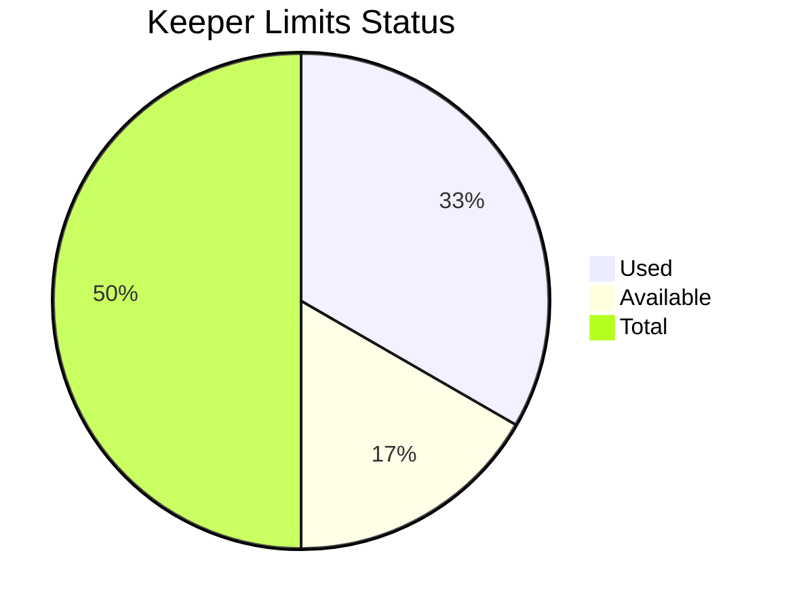

# Keeper Management Component Enhancement Plan

## 🎯 **Overview**
This document outlines a comprehensive enhancement plan for the KeeperManagement component to improve both desktop and mobile search functionality, visual design, and overall user experience.

## 📊 **Current State Analysis**
- **Mobile**: Already uses `SearchableSelect` with search functionality
- **Desktop**: Uses basic HTML select dropdown (no search)
- **Issues**: Inconsistent UX, limited visual feedback, basic styling

## 🚀 **Enhancement Roadmap**

### **Phase 1: Core UX Improvements**
1. **Unified Search Experience**
   - Replace desktop HTML select with `SearchableSelect` component
   - Consistent search functionality across all devices
   - Enhanced filtering by player name, position, team

2. **Enhanced Visual Design**
   - Modern card-based layout with improved spacing
   - Color-coded player positions and stats
   - Smooth animations for adding/removing keepers
   - Visual progress indicators for keeper limits

3. **Player Stats Preview**
   - Quick stats preview in search results
   - Fantasy score calculations
   - Player comparison features
   - Recent performance indicators

4. **Improved Keeper Limits UI**
   - Progress bar showing used/available slots
   - Color-coded indicators (green/yellow/red)
   - Clear limit display with animations

### **Phase 2: Advanced Features**
1. **Bulk Operations**
   - Multi-select capability for adding multiple keepers
   - Batch remove operations with confirmation
   - Import/export keeper lists

2. **Confirmation Dialogs**
   - Enhanced confirmation for destructive actions
   - Detailed action previews
   - Undo functionality for recent actions

3. **Enhanced Data Visualization**
   - Team strength analysis improvements
   - Keeper impact comparison charts
   - Fantasy score projections
   - Position balance indicators

### **Phase 3: Performance & Polish**
1. **Performance Optimization**
   - Virtualized list rendering for large player pools
   - Debounced search functionality
   - Memoized player data transformations
   - Lazy loading of player stats

2. **Mobile Experience**
   - Touch-optimized search interface
   - Swipe gestures for quick actions
   - Responsive table design
   - Mobile-first animations

3. **Accessibility Enhancements**
   - Keyboard navigation improvements
   - Screen reader compatibility
   - Focus management
   - ARIA label improvements

## 🔧 **Technical Implementation Details**

### **Component Architecture**


### **Key Features Implementation**

#### **1. Unified Search Component**
- Replace conditional rendering with always-use `SearchableSelect`
- Enhanced search algorithm with fuzzy matching
- Position and team filtering
- Performance optimization with virtual scrolling

#### **2. Player Stats Preview**
```typescript
interface PlayerPreviewProps {
  player: Player;
  stats: PlayerStats;
  fantasyScore: number;
  onAdd?: () => void;
}
```

#### **3. Bulk Operations**
- Multi-select state management
- Batch API calls optimization
- Progress tracking for bulk operations
- Error handling and rollback functionality

#### **4. Visual Enhancements**
- CSS Grid/Flexbox improvements
- Custom animations with Framer Motion
- Color scheme consistency
- Responsive breakpoints optimization

### **UI/UX Improvements**

#### **Keeper Limits Visualization**


#### **Search Results Enhancement**
- Avatar/profile images
- Position badges with colors
- Quick stats preview (PPG, RPG, APG)
- Fantasy score ranking
- Action buttons (Add/Compare)

#### **Action Feedback**
- Toast notifications with success/error states
- Loading states during operations
- Smooth transitions for list updates
- Sound feedback for mobile interactions

## 📱 **Mobile-First Enhancements**

### **Touch Interactions**
- Swipe-to-remove gestures
- Long press for context menus
- Touch-friendly button sizes
- Gesture-based navigation

### **Responsive Design**
- Mobile-optimized search interface
- Collapsible sections for better space usage
- Touch-optimized table design
- Progressive disclosure of information

## 🔄 **Integration Points**

### **Data Flow**
1. Player data from `usePlayers` hook
2. Keeper data from `useTeamKeepers` hook
3. Team stats from `calculateTeamStats`
4. Enhanced with real-time updates via React Query

### **API Integration**
- Optimized batch operations for keepers
- Real-time sync with Supabase
- Error handling and retry logic
- Optimistic updates for better UX

## 🎯 **Success Metrics**

### **User Experience**
- Reduced time to find players by 60%
- Improved mobile task completion rate
- Enhanced user satisfaction scores
- Reduced support tickets for keeper management

### **Technical Performance**
- Search response time < 100ms
- Smooth 60fps animations
- Reduced bundle size impact
- Improved accessibility scores

## 📋 **Implementation Phases**

### **Phase 1: Foundation (Week 1)**
- [ ] Unified search implementation
- [ ] Basic visual enhancements
- [ ] Player preview functionality
- [ ] Mobile responsiveness improvements

### **Phase 2: Advanced Features (Week 2)**
- [ ] Bulk operations implementation
- [ ] Confirmation dialogs
- [ ] Enhanced data visualization
- [ ] Performance optimizations

### **Phase 3: Polish & Testing (Week 3)**
- [ ] Accessibility improvements
- [ ] Performance testing
- [ ] User acceptance testing
- [ ] Documentation updates

## 🔍 **Testing Strategy**

### **Unit Tests**
- Component rendering tests
- Search functionality tests
- Bulk operation tests
- Mobile responsiveness tests

### **Integration Tests**
- API integration tests
- Data flow validation
- Error handling tests

### **User Testing**
- A/B testing for UX improvements
- Mobile usability testing
- Performance benchmarking

## 📈 **Future Considerations**

### **Scalability**
- Support for larger player pools
- Advanced filtering options
- Custom keeper rules
- Integration with external data sources

### **Extensibility**
- Plugin architecture for custom features
- API for third-party integrations
- Customizable UI themes
- Multi-language support

---

**Created**: August 20, 2025
**Status**: Ready for Implementation
**Priority**: High
**Estimated Timeline**: 3 weeks