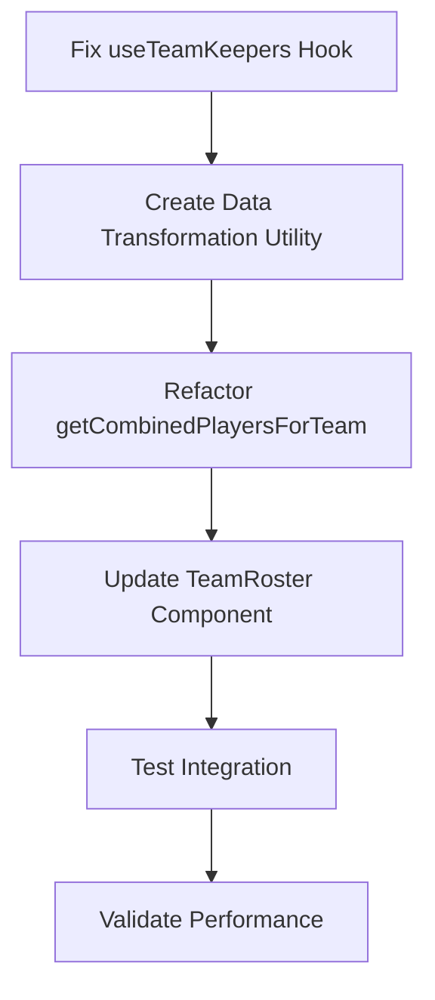

# Keepers Visibility Fix Plan

## Problem Analysis

The issue is in the `getCombinedPlayersForTeam` function within `useDraftPageData.ts`. The function is trying to process keeper data but encountering type mismatches and structural inconsistencies. Specifically:

1. **Data Structure Mismatch**: The keepers returned from `useTeamKeepers` have player stats properties instead of the expected nested `player` object structure
2. **Type Inconsistencies**: The filtering logic expects `KeeperPlayer[]` type but receives different structures
3. **Error in Processing**: The function throws an error when trying to access properties that don't exist on the keeper objects

## Proposed Solution

### Phase 1: Data Structure Standardization
1. **Fix useTeamKeepers Hook**: Ensure it returns consistent `KeeperPlayer` structure with proper nested `player` objects
2. **Create Data Transformation Utility**: Build a utility function to normalize keeper data structures
3. **Update Type Definitions**: Ensure all keeper-related types are properly aligned

### Phase 2: Unified Data Processing
1. **Refactor getCombinedPlayersForTeam**: Simplify the logic to handle keeper data consistently
2. **Consolidate Data Sources**: Make TeamRoster component use a single, unified data source
3. **Add Error Handling**: Implement proper error handling for malformed keeper data

### Phase 3: Testing & Validation
1. **Integration Testing**: Verify keepers appear correctly on the TeamRoster page
2. **Data Consistency Checks**: Ensure drafted and keeper players have consistent structure
3. **Performance Optimization**: Optimize queries to prevent unnecessary data fetching

## Implementation Approach

## Expected Outcomes
- Keepers will be visible on the TeamRoster page
- Consistent data structure between drafted and keeper players
- Improved error handling and debugging capabilities
- Better performance through optimized data fetching

## Files to Modify
- `renegades-draft-central/src/hooks/useTeamKeepers.ts`
- `renegades-draft-central/src/hooks/useDraftPageData.ts`
- `renegades-draft-central/src/components/TeamRoster.tsx`
- `renegades-draft-central/src/integrations/supabase/types/index.ts` (if needed)

## Risk Mitigation
- Add comprehensive error handling to prevent crashes
- Implement fallback data structures for edge cases
- Add logging for debugging data structure issues
- Test with various keeper configurations

## Success Criteria
- Keepers are visible on TeamRoster page
- No console errors related to keeper data processing
- Consistent performance across different team configurations
- Proper error handling for edge cases