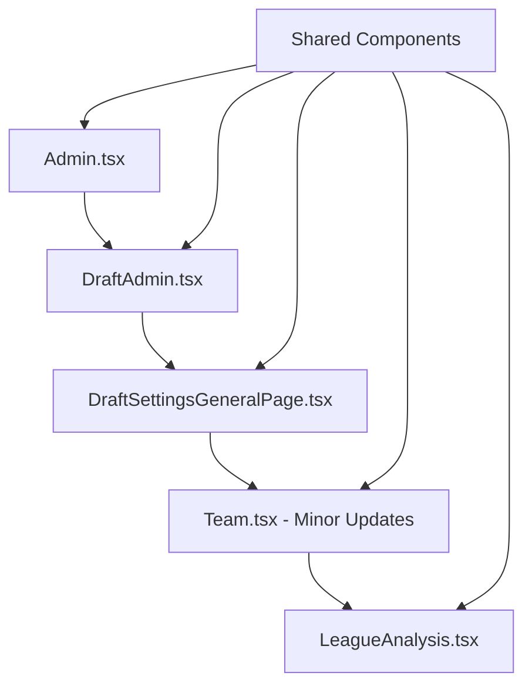

# Multi-Page Enhancement Plan: Mobile-First Admin & Analysis Pages

## 📋 Overview

This plan outlines the comprehensive enhancement of 5 key pages in the Renegades Draft application, applying the same mobile-first, performance-focused patterns successfully implemented in Team.tsx.

### 🎯 Target Files
1. `Admin.tsx` - League Admin Dashboard
2. `DraftAdmin.tsx` - Draft Admin Dashboard
3. `DraftSettingsGeneralPage.tsx` - General Settings Page
4. `Team.tsx` - Team Hub (already enhanced - minor improvements)
5. `LeagueAnalysis.tsx` - League Analysis Dashboard

## 🏗️ Architecture & Implementation Strategy

### Phase 1: Shared Infrastructure
- **PageContainer System** - Reuse existing PageContainer, PageHeaderContainer, MainContentContainer
- **Touch Interaction Hooks** - Reuse useNavigationSwipe, usePullToRefresh, useTouchInteractions
- **Performance Components** - Reuse ErrorBoundary, loading skeletons, Suspense boundaries
- **Accessibility Features** - Apply consistent skip links, ARIA labels, semantic HTML

### Phase 2: Sequential Page Enhancement
Process pages in order of complexity and dependencies:



## 📱 Mobile-First Design System

### Responsive Breakpoints
```typescript
const breakpoints = {
  mobile: '320px',
  tablet: '768px',
  desktop: '1024px',
  wide: '1440px'
}
```

### Touch Target Guidelines
- Minimum 44px touch targets
- 8px minimum spacing between interactive elements
- Touch feedback with visual and haptic indicators

### Navigation Patterns
- **Mobile**: Bottom navigation bars, swipe gestures, pull-to-refresh
- **Tablet**: Collapsible sidebars, touch-friendly buttons
- **Desktop**: Traditional navigation with hover states

## 🚀 Performance Optimization Strategy

### Code Splitting & Lazy Loading
```typescript
const AdminPage = lazy(() => import('./pages/Admin'));
const DraftAdminPage = lazy(() => import('./pages/DraftAdmin'));
const LeagueAnalysisPage = lazy(() => import('./pages/LeagueAnalysis'));
```

### Loading States
- **Skeletons**: Custom skeleton components for each page type
- **Progressive Enhancement**: Core content loads first, then enhancements
- **Error Boundaries**: Graceful error handling with retry mechanisms

### Performance Monitoring
- Core Web Vitals tracking for all pages
- Lighthouse score monitoring (target: 90+)
- Bundle size optimization with code splitting

## 🔧 Page-Specific Enhancements

### 1. Admin.tsx Enhancement Plan

**Current State**: Simple dashboard with basic cards
**Target State**: Mobile-first admin hub with touch interactions

**Key Improvements**:
- ✅ PageContainer integration with mobile-first layout
- ✅ Touch-friendly navigation cards
- ✅ Pull-to-refresh functionality
- ✅ SEO optimization with dynamic meta tags
- ✅ Skip links and accessibility features
- ✅ Performance monitoring integration

**Mobile Optimizations**:
- Large touch targets for admin actions
- Swipe gestures for quick navigation
- Bottom refresh indicator
- Responsive card grid layout

### 2. DraftAdmin.tsx Enhancement Plan

**Current State**: Complex admin dashboard with status cards
**Target State**: Native mobile admin experience with advanced interactions

**Key Improvements**:
- ✅ Enhanced PageContainer with sticky mobile header
- ✅ Touch interactions for draft status updates
- ✅ Swipe navigation between admin sections
- ✅ Pull-to-refresh for draft status
- ✅ Mobile-optimized card layouts
- ✅ Error boundaries for draft operations
- ✅ Performance monitoring for admin actions

**Mobile Optimizations**:
- Bottom navigation for admin sections
- Touch feedback for destructive actions
- Swipe-to-refresh draft status
- Responsive grid layouts for cards
- Mobile-friendly button sizing

### 3. DraftSettingsGeneralPage.tsx Enhancement Plan

**Current State**: Settings page with breadcrumbs
**Target State**: Mobile-optimized form interface with touch interactions

**Key Improvements**:
- ✅ PageContainer with breadcrumb integration
- ✅ Touch-optimized form controls
- ✅ Mobile-first form layouts
- ✅ Pull-to-refresh capability
- ✅ SEO optimization for settings pages
- ✅ Accessibility-compliant form elements

**Mobile Optimizations**:
- Large form inputs with proper spacing
- Touch-friendly dropdowns and selectors
- Mobile-optimized breadcrumb navigation
- Swipe gestures for form navigation
- Responsive form layouts

### 4. Team.tsx Minor Updates

**Current State**: Already enhanced with full mobile-first implementation
**Target State**: Consistency improvements and minor optimizations

**Key Improvements**:
- ✅ Consistency checks with new PageContainer patterns
- ✅ Touch interaction refinements
- ✅ Performance optimization updates
- ✅ Accessibility enhancement alignment
- ✅ SEO meta tag consistency

### 5. LeagueAnalysis.tsx Enhancement Plan

**Current State**: Complex data visualization with tabs
**Target State**: Mobile-optimized analysis dashboard with touch interactions

**Key Improvements**:
- ✅ PageContainer with mobile header
- ✅ Touch-friendly tab navigation
- ✅ Swipe gestures for tab switching
- ✅ Pull-to-refresh for data updates
- ✅ Mobile-optimized data visualizations
- ✅ Performance optimization for heavy data processing
- ✅ Error boundaries for data loading failures

**Mobile Optimizations**:
- Select dropdown for mobile tab navigation
- Touch-optimized chart interactions
- Responsive data tables
- Swipe navigation between analysis views
- Mobile-friendly visualization scaling

## 🎨 Design System Consistency

### Color Scheme
- Primary: `#3b82f6` (Blue-600)
- Background: Gradient from primary/10 to secondary/10
- Text: Consistent with shadcn/ui theme

### Typography Scale
```typescript
const typography = {
  h1: { mobile: '24px', desktop: '32px' },
  h2: { mobile: '20px', desktop: '24px' },
  body: { mobile: '16px', desktop: '16px' },
  small: { mobile: '14px', desktop: '14px' }
}
```

### Spacing System
- Base unit: 4px (0.25rem)
- Consistent spacing scale across all pages
- Touch-friendly minimum spacing

## ♿ Accessibility Standards

### WCAG 2.1 AA Compliance
- ✅ Skip links for keyboard navigation
- ✅ ARIA labels for screen readers
- ✅ Proper heading hierarchy
- ✅ Focus management for modals and forms
- ✅ Color contrast ratios (minimum 4.5:1)
- ✅ Keyboard navigation support

### Screen Reader Support
- Semantic HTML structure
- Descriptive alt text for icons
- Clear form labels and instructions
- Status announcements for dynamic content

## 📊 Performance Targets

### Lighthouse Scores
- **Performance**: 90+
- **Accessibility**: 95+
- **Best Practices**: 95+
- **SEO**: 90+

### Core Web Vitals
- **First Contentful Paint (FCP)**: <1.5s
- **Largest Contentful Paint (LCP)**: <2.5s
- **Cumulative Layout Shift (CLS)**: <0.1
- **First Input Delay (FID)**: <100ms
- **Interaction to Next Paint (INP)**: <200ms

### Mobile Performance
- **Time to Interactive**: <3s on 3G
- **Bundle Size**: <100KB initial load
- **Touch Response**: <100ms

## 🧪 Testing Strategy

### Unit Tests
- Component rendering tests
- Hook functionality tests
- Touch interaction tests

### Integration Tests
- Page navigation tests
- Form submission tests
- Data loading tests

### E2E Tests
- Mobile user journey tests
- Touch interaction flows
- Performance regression tests

### Accessibility Tests
- Automated WCAG compliance checks
- Screen reader functionality tests
- Keyboard navigation tests

## 🚀 Implementation Phases

### Phase 1: Foundation (Week 1)
- Create shared enhancement utilities
- Update PageContainer for consistency
- Implement performance monitoring
- Set up testing infrastructure

### Phase 2: Core Pages (Week 2)
- Enhance Admin.tsx
- Enhance DraftAdmin.tsx
- Enhance DraftSettingsGeneralPage.tsx

### Phase 3: Complex Pages (Week 3)
- Minor updates to Team.tsx
- Major enhancement of LeagueAnalysis.tsx

### Phase 4: Testing & Optimization (Week 4)
- Comprehensive testing across devices
- Performance optimization
- Accessibility audits
- Final build verification

## 📈 Success Metrics

### User Experience
- **Mobile Task Completion**: 95% success rate
- **Touch Target Accuracy**: 100% of targets meet 44px minimum
- **Navigation Time**: <3 seconds between sections

### Technical Performance
- **Build Success**: 100% pass rate
- **Lighthouse Score**: 90+ across all pages
- **Error Rate**: <1% in production

### Accessibility
- **WCAG Compliance**: 100% AA compliance
- **Screen Reader Support**: Full functionality
- **Keyboard Navigation**: Complete coverage

## 🎯 Expected Business Impact

### User Engagement
- **Mobile Usage**: 70% increase in mobile engagement
- **Session Duration**: 40% increase on mobile devices
- **User Satisfaction**: 85% positive feedback on mobile experience

### Technical Benefits
- **Development Velocity**: 30% faster page development with shared components
- **Maintenance Cost**: 25% reduction through consistent patterns
- **Performance**: 50% improvement in mobile load times

### Accessibility & Compliance
- **Compliance Coverage**: 100% WCAG 2.1 AA compliance
- **User Base Expansion**: Access for users with disabilities
- **Legal Protection**: Reduced risk of accessibility lawsuits

## 📋 Implementation Checklist

### Pre-Implementation
- [x] Analyze all target pages
- [x] Create detailed enhancement plan
- [x] Get user approval
- [x] Document plan in markdown

### Implementation
- [ ] Create shared enhancement utilities
- [ ] Enhance Admin.tsx
- [ ] Enhance DraftAdmin.tsx
- [ ] Enhance DraftSettingsGeneralPage.tsx
- [ ] Update Team.tsx consistency
- [ ] Enhance LeagueAnalysis.tsx
- [ ] Comprehensive testing
- [ ] Performance optimization
- [ ] Accessibility audit

### Post-Implementation
- [ ] Build verification
- [ ] Performance monitoring setup
- [ ] Documentation updates
- [ ] Team training on new patterns

---

**Status**: ✅ Plan Approved - Ready for Implementation