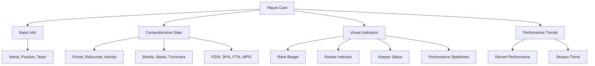
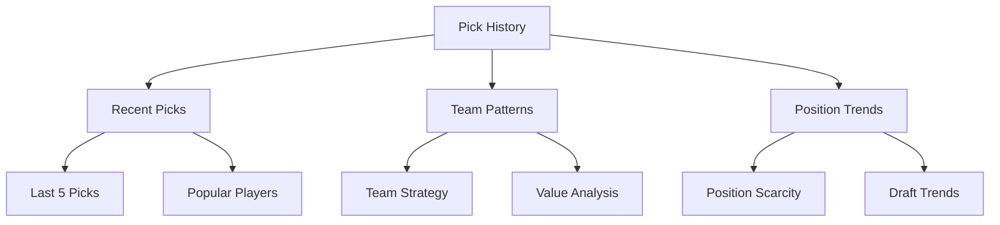
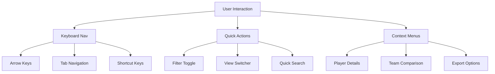
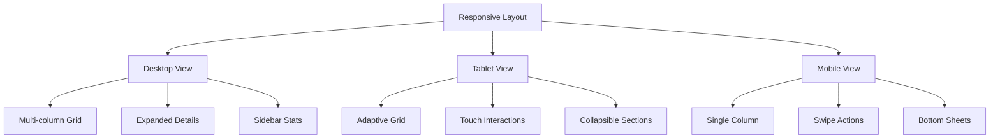
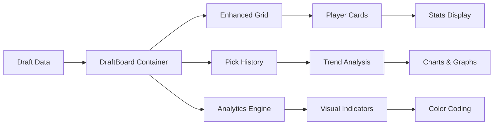
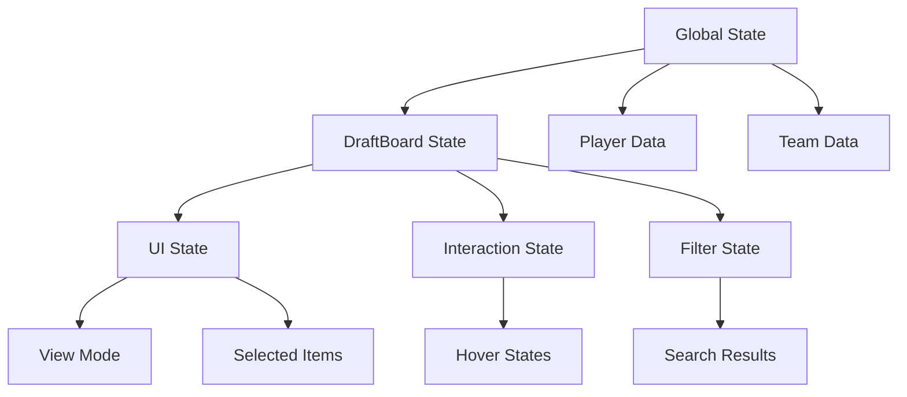

# DraftBoard Enhancement Plan

## Overview
This document outlines a comprehensive enhancement plan for the DraftBoard component in the Renegades Draft application. The goal is to significantly improve the user experience by adding advanced features, better visual design, and enhanced functionality inspired by professional fantasy sports platforms like Sleeper.

## Current State Analysis
The current DraftBoard component includes:
- Basic grid layout with team colors
- Simple accordion for player details
- Limited stats display (points, rebounds, assists)
- Basic responsive design
- Current pick highlighting

## Proposed Enhancements

### 1. Enhanced Player Statistics & Visual Indicators



### 2. Pick History & Trend Analysis



### 3. Advanced Interactions & Navigation



### 4. Mobile-First Responsive Design



## Implementation Phases

### Phase 1: Foundation (Week 1)
1. **Enhanced Player Stats Display**
   - Add comprehensive stats: blocks, steals, turnovers, percentages
   - Performance sparklines and trend indicators
   - Rookie and keeper status badges
   - Rank positioning

2. **Improved Visual Design**
   - Smooth animations for state transitions
   - Enhanced hover effects and micro-interactions
   - Better use of team color gradients
   - Loading states and skeleton screens

### Phase 2: Advanced Features (Week 2)
3. **Pick History & Analytics**
   - Recent picks sidebar
   - Team strategy analysis
   - Position scarcity indicators
   - Value over replacement metrics

4. **Interactive Features**
   - Keyboard navigation (arrow keys, tab, shortcuts)
   - Quick search functionality
   - Context menus for detailed actions
   - Pick recommendations

### Phase 3: Polish & Optimization (Week 3)
5. **Mobile & Accessibility**
   - Touch-optimized interactions
   - Screen reader support
   - Keyboard accessibility
   - Responsive breakpoints

6. **Performance & UX**
   - Virtual scrolling for large drafts
   - Optimized animations
   - Error boundaries
   - Offline support indicators

## Technical Architecture

### Component Structure
```
DraftBoard/
├── DraftBoardContainer (Main wrapper)
├── EnhancedDraftGrid (Grid layout)
├── PlayerCard (Enhanced card)
├── PickHistoryPanel (Sidebar)
├── MobileNavigation (Mobile controls)
├── SearchAndFilter (Header component)
└── AnalyticsOverlay (Floating analytics)
```

### Data Flow


### State Management


## Key Features to Implement

### Enhanced Player Cards
- Expandable stats panel with all available metrics
- Performance trend charts
- Comparison indicators
- Action buttons (favorite, compare, etc.)

### Smart Search & Filtering
- Real-time search across players and teams
- Advanced filters (position, stats, availability)
- Saved filter presets
- Quick filter toggles

### Pick Analytics
- Real-time draft value calculations
- Team needs analysis
- Position scarcity tracking
- Historical comparison data

### Accessibility Features
- Full keyboard navigation
- Screen reader optimization
- High contrast mode
- Focus management

## Real-time State Management
The enhanced DraftBoard will implement real-time state management to ensure:
- Live updates during draft progression
- Real-time pick validation
- Instant UI updates for all connected users
- Optimistic updates for better user experience

## Success Metrics
- **Performance**: <100ms interaction response time
- **Accessibility**: WCAG 2.1 AA compliance
- **Mobile**: Touch target sizes >44px
- **User Experience**: Intuitive navigation patterns

## Development Guidelines
- Phased rollout approach
- Real-time state management priority
- Mobile-first responsive design
- Accessibility compliance
- Performance optimization
- Comprehensive testing

## Timeline
- **Phase 1**: Foundation (Week 1)
- **Phase 2**: Advanced Features (Week 2)
- **Phase 3**: Polish & Optimization (Week 3)
- **Testing**: Week 4
- **Deployment**: Week 4

## Dependencies
- Existing team color system
- Supabase real-time subscriptions
- Player statistics database
- UI component library
- Animation libraries

## Risk Assessment
- **Real-time performance**: Mitigated by efficient state management
- **Mobile complexity**: Addressed with mobile-first approach
- **Accessibility compliance**: Built-in from design phase
- **Data complexity**: Handled through progressive enhancement

---

**Created**: August 20, 2025
**Status**: Approved for Implementation
**Priority**: High
**Assignee**: Code Mode Implementation Team