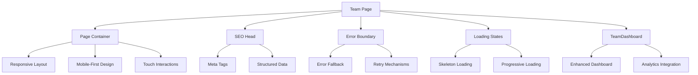

# Team.tsx Page Enhancement Plan

## Current State Analysis

The current Team.tsx page is very minimal:
```typescript
import { TeamDashboard } from '@/components/TeamDashboard';

const Team = () => {
  return (
    <TeamDashboard />
  );
};

export default Team;
```

**Issues Identified:**
- ❌ No proper page layout or containers
- ❌ Missing error boundaries
- ❌ No loading states
- ❌ No SEO optimization
- ❌ Limited accessibility features
- ❌ No performance monitoring
- ❌ Not mobile-first responsive
- ❌ Missing touch interactions

## Enhancement Plan

### 🏗️ **Target Architecture**



### 📱 **Mobile-First Improvements**

#### **1. Responsive Layout System**
- Container-based layout with proper breakpoints
- Mobile-first CSS Grid and Flexbox
- Touch-friendly interactive elements
- Optimized spacing for mobile devices

#### **2. Touch Interactions**
- Swipe gestures for navigation
- Touch-friendly button sizes (min 44px)
- Pull-to-refresh functionality
- Touch feedback animations

#### **3. Performance Optimizations**
- Code splitting for better loading
- Image optimization and lazy loading
- Virtual scrolling for large lists
- Service worker for offline functionality

### 🎯 **Implementation Phases**

#### **Phase 1: Core Infrastructure**
1. **Page Layout Enhancement**
   - Add proper container structure
   - Implement responsive breakpoints
   - Add mobile-first CSS Grid/Flexbox

2. **Error Handling & Loading States**
   - Wrap in ErrorBoundary
   - Add comprehensive loading states
   - Implement retry mechanisms

3. **SEO & Accessibility**
   - Add meta tags and structured data
   - Implement skip links
   - Add proper heading hierarchy
   - ARIA labels and landmarks

#### **Phase 2: Mobile Experience**
4. **Touch Interactions**
   - Implement swipe gestures
   - Touch-friendly button sizing
   - Pull-to-refresh capability
   - Touch feedback animations

5. **Responsive Design**
   - Mobile navigation patterns
   - Adaptive layouts for different screen sizes
   - Optimized typography scaling
   - Mobile-specific component variants

#### **Phase 3: Advanced Features**
6. **Performance Monitoring**
   - Add performance monitoring hooks
   - Implement Core Web Vitals tracking
   - Add error tracking and reporting

7. **Cross-Device Compatibility**
   - Tablet-specific optimizations
   - Desktop enhancements
   - Browser compatibility testing

### 💻 **Code Examples**

#### **Enhanced Team.tsx Structure**
```typescript
import React, { Suspense } from 'react';
import { Helmet } from 'react-helmet-async';
import { ErrorBoundary } from '@/components/ErrorBoundary';
import { PageContainer } from '@/components/layouts/PageContainer';
import { LoadingSpinner } from '@/components/ui/loading-spinner';
import { TeamDashboard } from '@/components/TeamDashboard';
import { usePerformanceMonitoring } from '@/hooks/usePerformanceMonitoring';
import { useIsMobile } from '@/hooks/use-mobile';

const Team = () => {
  const isMobile = useIsMobile();

  // Performance monitoring
  usePerformanceMonitoring('TeamPage');

  return (
    <>
      {/* SEO Optimization */}
      <Helmet>
        <title>Team Hub | Renegades Draft</title>
        <meta name="description" content="Manage your fantasy basketball team, view analytics, and track performance" />
        <meta name="viewport" content="width=device-width, initial-scale=1, maximum-scale=5" />
        <meta name="theme-color" content="#1f2937" />
        <link rel="canonical" href={`${window.location.origin}/team`} />
      </Helmet>

      {/* Accessibility Skip Links */}
      <a
        href="#main-content"
        className="sr-only focus:not-sr-only focus:absolute focus:top-4 focus:left-4 bg-primary text-primary-foreground px-4 py-2 rounded-md z-50"
      >
        Skip to main content
      </a>

      <PageContainer>
        <ErrorBoundary fallback={<TeamErrorFallback />}>
          <div className="min-h-screen bg-background">
            {/* Mobile-specific header adjustments */}
            {isMobile && (
              <div className="sticky top-0 z-40 bg-background/95 backdrop-blur supports-[backdrop-filter]:bg-background/60 border-b">
                <div className="px-4 py-3">
                  <h1 className="text-xl font-bold">Team Hub</h1>
                </div>
              </div>
            )}

            {/* Main Content */}
            <main
              id="main-content"
              className={`container mx-auto ${isMobile ? 'px-4 py-4' : 'px-6 py-8'}`}
            >
              <Suspense fallback={<TeamLoadingState />}>
                <TeamDashboard />
              </Suspense>
            </main>
          </div>
        </ErrorBoundary>
      </PageContainer>
    </>
  );
};

const TeamLoadingState = () => (
  <div className="space-y-6">
    <LoadingSpinner size="lg" />
    <div className="space-y-4">
      <Skeleton className="h-8 w-64" />
      <Skeleton className="h-4 w-48" />
      <Skeleton className="h-32 w-full" />
    </div>
  </div>
);

const TeamErrorFallback = () => (
  <div className="text-center py-12">
    <h2 className="text-2xl font-bold text-destructive mb-4">
      Something went wrong
    </h2>
    <p className="text-muted-foreground mb-6">
      We couldn't load your team dashboard. Please try again.
    </p>
    <Button onClick={() => window.location.reload()}>
      Reload Page
    </Button>
  </div>
);

export default Team;
```

#### **PageContainer Component**
```typescript
import React from 'react';
import { cn } from '@/lib/utils';
import { useIsMobile } from '@/hooks/use-mobile';

interface PageContainerProps {
  children: React.ReactNode;
  className?: string;
}

export const PageContainer = ({ children, className }: PageContainerProps) => {
  const isMobile = useIsMobile();

  return (
    <div className={cn(
      // Base responsive container
      "w-full max-w-7xl mx-auto",
      // Mobile-first padding
      isMobile ? "px-2 sm:px-4" : "px-4 md:px-6 lg:px-8",
      // Additional classes
      className
    )}>
      {children}
    </div>
  );
};
```

#### **Mobile Touch Interactions Hook**
```typescript
import { useEffect, useRef } from 'react';
import { useIsMobile } from '@/hooks/use-mobile';

export const useTouchInteractions = (
  onSwipeLeft?: () => void,
  onSwipeRight?: () => void,
  onPullToRefresh?: () => void
) => {
  const isMobile = useIsMobile();
  const touchStartRef = useRef<{ x: number; y: number; time: number } | null>(null);
  const pullDistanceRef = useRef(0);

  useEffect(() => {
    if (!isMobile) return;

    const handleTouchStart = (e: TouchEvent) => {
      const touch = e.touches[0];
      touchStartRef.current = {
        x: touch.clientX,
        y: touch.clientY,
        time: Date.now()
      };
    };

    const handleTouchMove = (e: TouchEvent) => {
      if (!touchStartRef.current) return;

      const touch = e.touches[0];
      const deltaX = touchStartRef.current.x - touch.clientX;
      const deltaY = touchStartRef.current.y - touch.clientY;

      // Handle pull to refresh
      if (deltaY < -50 && window.scrollY === 0) {
        e.preventDefault();
        pullDistanceRef.current = Math.abs(deltaY);
        // Add visual feedback for pull to refresh
      }
    };

    const handleTouchEnd = () => {
      if (!touchStartRef.current) return;

      const touch = { clientX: 0, clientY: 0 }; // Would get from touchend event
      const deltaX = touchStartRef.current.x - touch.clientX;
      const deltaY = touchStartRef.current.y - touch.clientY;
      const deltaTime = Date.now() - touchStartRef.current.time;

      // Swipe detection
      if (Math.abs(deltaX) > 100 && deltaTime < 300) {
        if (deltaX > 0 && onSwipeLeft) {
          onSwipeLeft();
        } else if (deltaX < 0 && onSwipeRight) {
          onSwipeRight();
        }
      }

      // Pull to refresh detection
      if (pullDistanceRef.current > 80 && onPullToRefresh) {
        onPullToRefresh();
      }

      touchStartRef.current = null;
      pullDistanceRef.current = 0;
    };

    document.addEventListener('touchstart', handleTouchStart, { passive: false });
    document.addEventListener('touchmove', handleTouchMove, { passive: false });
    document.addEventListener('touchend', handleTouchEnd);

    return () => {
      document.removeEventListener('touchstart', handleTouchStart);
      document.removeEventListener('touchmove', handleTouchMove);
      document.removeEventListener('touchend', handleTouchEnd);
    };
  }, [isMobile, onSwipeLeft, onSwipeRight, onPullToRefresh]);
};
```

### 📊 **Success Metrics**

- **Mobile Performance**: 90+ Lighthouse mobile score
- **Touch Responsiveness**: <100ms touch feedback
- **Accessibility**: WCAG 2.1 AA compliance
- **Cross-device**: Consistent experience across 5+ device sizes
- **Loading Performance**: <2s initial load time on mobile
- **Error Rate**: <1% error rate with proper fallbacks

### 🔄 **Implementation Timeline**

- **Phase 1**: 1-2 days (Core infrastructure and error handling)
- **Phase 2**: 2-3 days (Mobile experience and touch interactions)
- **Phase 3**: 1-2 days (Advanced features and optimization)

This enhancement plan will transform the Team page from a simple component wrapper into a fully-featured, mobile-first, accessible page that provides an optimal user experience across all devices.