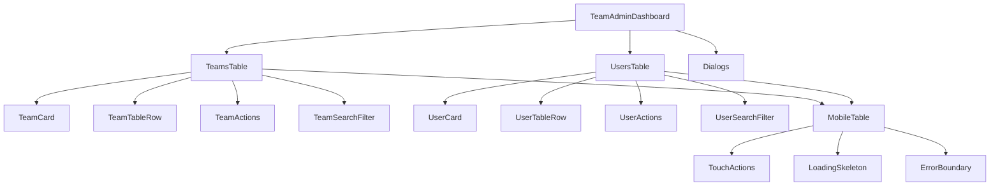

# TeamAdmin Components Refactoring Plan

## 📋 Overview

This comprehensive plan outlines the architectural refactoring and mobile-first enhancement of the TeamAdmin dashboard components. The goal is to transform the current monolithic components into a modular, maintainable, and mobile-first architecture while maintaining full backward compatibility.

## 🏗️ Architecture Overview

### Current State
- **TeamsTable**: 71-line monolithic component
- **UsersTable**: 71-line monolithic component
- **TeamAdminDashboard**: Large orchestration component with inline handlers
- **Limited Mobile Support**: No responsive design or touch interactions

### Target State
- **Modular Components**: Each component has a single responsibility
- **Mobile-First Design**: Responsive layouts with touch interactions
- **Real-time Integration**: Optimistic updates and conflict resolution
- **Performance Optimized**: Memoization, virtualization, and caching

### Component Architecture



## 📁 File Structure

```
src/components/admin/
├── teams/
│   ├── index.ts
│   ├── TeamsTable.tsx              # Main orchestration component
│   ├── TeamCard.tsx                # Mobile card layout
│   ├── TeamTableRow.tsx            # Desktop table row
│   ├── TeamActions.tsx             # Action buttons and menus
│   ├── TeamSearchFilter.tsx        # Search and filter functionality
│   └── types.ts                    # Team-specific types
├── users/
│   ├── index.ts
│   ├── UsersTable.tsx              # Main orchestration component
│   ├── UserCard.tsx                # Mobile card layout
│   ├── UserTableRow.tsx            # Desktop table row
│   ├── UserActions.tsx             # Action buttons and menus
│   ├── UserSearchFilter.tsx        # Search and filter functionality
│   └── types.ts                    # User-specific types
├── shared/
│   ├── index.ts
│   ├── MobileTable.tsx             # Responsive table wrapper
│   ├── TouchActions.tsx            # Swipe gesture handler
│   ├── LoadingSkeleton.tsx         # Loading state components
│   ├── ErrorBoundary.tsx           # Error handling wrapper
│   ├── OptimisticUpdate.tsx        # Optimistic UI patterns
│   ├── types.ts                    # Shared types
│   └── hooks/                      # Shared hooks
│       ├── useOptimisticUpdates.ts
│       ├── useTouchGestures.ts
│       └── useInfiniteScroll.ts
└── dashboard/
    └── TeamAdminDashboard.tsx      # Orchestration component
```

## 🔧 Component Specifications

### 1. TeamsTable Component Suite

#### TeamsTable.tsx (Main Orchestration)
```typescript
interface TeamsTableProps {
  teams: Team[];
  onEdit: (team: Team) => void;
  onDelete: (teamId: string) => void;
  onManageRoster: (team: Team) => void;
  onManageKeepers: (team: Team) => void;
  isLoading?: boolean;
  error?: string | null;
}

Features:
- Layout switching (table/card) based on screen size
- Search and filter integration
- Loading states and error handling
- Real-time updates integration
```

#### TeamCard.tsx (Mobile Layout)
```typescript
interface TeamCardProps {
  team: Team;
  variant?: 'default' | 'compact';
  onEdit?: (team: Team) => void;
  onDelete?: (teamId: string) => void;
  onManageRoster?: (team: Team) => void;
  onManageKeepers?: (team: Team) => void;
  showActions?: boolean;
}

Features:
- Touch-friendly card design
- Swipe actions (left: edit, right: delete)
- Long press context menu
- Responsive typography
- Visual feedback for touch interactions
```

#### TeamActions.tsx (Action Handler)
```typescript
interface TeamActionsProps {
  team: Team;
  actions: TeamAction[];
  variant?: 'buttons' | 'menu' | 'swipe';
  onAction: (action: string, team: Team) => void;
}

Features:
- Multiple action variants (buttons, dropdown menu, swipe)
- Touch-optimized button sizes (min 44px)
- Accessibility support (ARIA labels, keyboard navigation)
- Loading states for async actions
```

### 2. UsersTable Component Suite

#### UsersTable.tsx (Main Orchestration)
```typescript
interface UsersTableProps {
  users: User[];
  teams: Team[];
  onEdit: (user: User) => void;
  onDelete: (userId: string) => void;
  onRemoveFromTeam: (userId: string) => void;
  isLoading?: boolean;
  error?: string | null;
}

Features:
- Similar to TeamsTable but user-focused
- Team assignment display
- Bulk operations support
- Advanced filtering options
```

#### UserCard.tsx (Mobile Layout)
```typescript
interface UserCardProps {
  user: User;
  team?: Team;
  variant?: 'default' | 'compact';
  onEdit?: (user: User) => void;
  onDelete?: (userId: string) => void;
  onRemoveFromTeam?: (userId: string) => void;
  showActions?: boolean;
}

Features:
- User avatar and status indicators
- Team assignment badges
- Swipe-to-action gestures
- Touch feedback animations
```

### 3. Shared Components

#### MobileTable.tsx (Responsive Wrapper)
```typescript
interface MobileTableProps {
  children: ReactNode;
  breakpoint?: number;
  layout?: 'table' | 'card' | 'auto';
  className?: string;
}

Features:
- Automatic layout switching
- Responsive breakpoint management
- Touch gesture integration
- Performance optimizations
```

#### TouchActions.tsx (Gesture Handler)
```typescript
interface TouchActionsProps {
  children: ReactNode;
  onSwipeLeft?: () => void;
  onSwipeRight?: () => void;
  onLongPress?: () => void;
  threshold?: number;
}

Features:
- Multi-touch gesture support
- Swipe direction detection
- Long press handling
- Velocity-based animations
```

#### LoadingSkeleton.tsx (Loading States)
```typescript
interface LoadingSkeletonProps {
  variant?: 'table' | 'card' | 'list';
  rows?: number;
  showAvatar?: boolean;
  className?: string;
}

Features:
- Multiple skeleton variants
- Animated loading states
- Responsive design
- Accessibility support
```

## 🎨 Design System

### Mobile-First Breakpoints
```typescript
const breakpoints = {
  mobile: '320px',
  tablet: '768px',
  desktop: '1024px',
  wide: '1440px'
}
```

### Touch Target Guidelines
- **Minimum Size**: 44px × 44px
- **Spacing**: 8px minimum between targets
- **Feedback**: Visual + haptic feedback
- **Accessibility**: High contrast ratios

### Component Variants
```typescript
type ComponentSize = 'sm' | 'md' | 'lg'
type ComponentVariant = 'default' | 'compact' | 'detailed'
type LayoutMode = 'table' | 'card' | 'auto'
```

## 🚀 Implementation Phases

### Phase 0: Architecture & Foundation (Week 1)
1. Create new file structure
2. Extract shared types and interfaces
3. Set up component composition patterns
4. Create shared hooks and utilities

### Phase 1: TeamsTable Refactoring (Week 2)
1. Create TeamsTable orchestration component
2. Implement TeamCard mobile layout
3. Build TeamActions component
4. Add TeamSearchFilter functionality
5. Integrate with existing real-time hooks

### Phase 2: UsersTable Refactoring (Week 3)
1. Create UsersTable orchestration component
2. Implement UserCard mobile layout
3. Build UserActions component
4. Add UserSearchFilter functionality
5. Integrate with team assignment logic

### Phase 3: Mobile-First Enhancements (Week 4)
1. Implement responsive design patterns
2. Add touch gesture support
3. Optimize for performance
4. Add comprehensive error handling

### Phase 4: Real-time Integration (Week 5)
1. Add optimistic UI updates
2. Implement conflict resolution
3. Integrate with Supabase subscriptions
4. Add offline support patterns

### Phase 5: Testing & Polish (Week 6)
1. Unit tests for all components
2. Integration testing
3. Accessibility testing
4. Performance optimization
5. Production readiness validation

## 📊 Success Metrics

### Performance Targets
- **First Contentful Paint**: <1.5s
- **Largest Contentful Paint**: <2.5s
- **Cumulative Layout Shift**: <0.1
- **Interaction to Next Paint**: <200ms

### Accessibility Standards
- WCAG 2.1 AA compliance
- Touch target size: 44px minimum
- Color contrast ratio: 4.5:1 minimum
- Keyboard navigation support

### Mobile Experience
- Touch gesture support
- Responsive design across all breakpoints
- Smooth animations and transitions
- Offline functionality

## 🧪 Testing Strategy

### Component Testing
- Unit tests for each component
- Integration tests for component interactions
- E2E tests for critical user journeys

### Mobile Testing
- Touch interaction testing
- Responsive design validation
- Performance testing on mobile devices

### Accessibility Testing
- Screen reader compatibility
- Keyboard navigation testing
- Color contrast validation

## 🔄 Migration Strategy

### Backward Compatibility
- Existing API contracts maintained
- Gradual rollout with feature flags
- Fallback to old components if needed

### Data Migration
- No data migration required
- Component props remain compatible
- State management unchanged

### Rollout Plan
1. Deploy new components behind feature flags
2. A/B test with subset of users
3. Monitor performance and user feedback
4. Full rollout after validation

## 📋 Implementation Checklist

### Pre-Implementation
- [x] Create detailed component specifications
- [x] Set up new file structure
- [x] Extract shared types and interfaces
- [x] Plan backward compatibility strategy

### Implementation
- [ ] Create shared component library
- [ ] Refactor TeamsTable into modular components
- [ ] Refactor UsersTable into modular components
- [ ] Implement mobile-first responsive design
- [ ] Add touch interaction support
- [ ] Integrate real-time updates
- [ ] Add comprehensive error handling
- [ ] Implement performance optimizations
- [ ] Add accessibility features
- [ ] Create comprehensive test suite

### Post-Implementation
- [ ] Performance validation
- [ ] Accessibility audit
- [ ] Mobile testing across devices
- [ ] User acceptance testing
- [ ] Production deployment

---

**Status**: ✅ Plan Approved - Ready for Implementation
**Architecture**: Modular Component Design
**Focus**: Mobile-First, Real-time, Performance
**Timeline**: 6 weeks
**Risk Level**: Medium
**Dependencies**: Existing Supabase integration, Real-time hooks