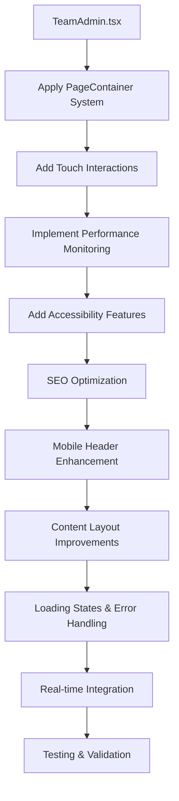

# TeamAdmin.tsx Mobile-First Enhancement Plan

## 📋 Overview

This plan outlines the comprehensive enhancement of the TeamAdmin.tsx page to apply mobile-first design patterns, performance optimizations, and accessibility improvements consistent with the multi-page enhancement plan.

## 🎯 Current State Analysis

**TeamAdmin.tsx** is currently a basic page with:
- Simple background gradient and basic layout
- No mobile-first responsive design
- No touch interaction capabilities
- No performance monitoring
- No accessibility features
- No SEO optimization
- Basic error handling

## 🏗️ Enhancement Implementation Strategy

### Phase 1: Infrastructure & Layout
1. **Replace current layout with PageContainer system**:
   - Use `PageContainer` with `maxWidth="7xl"` and responsive padding
   - Implement `PageHeaderContainer` with sticky mobile header
   - Add `MainContentContainer` with proper semantic structure

2. **Mobile-first responsive design**:
   - Touch-friendly button sizing (minimum 44px)
   - Responsive typography scaling
   - Mobile-optimized spacing and layout

### Phase 2: Touch Interactions & Performance
3. **Add touch interaction hooks**:
   - `usePullToRefresh` for data refresh functionality
   - `useTouchInteractions` for swipe gestures
   - Touch feedback for all interactive elements

4. **Performance monitoring integration**:
   - `usePerformanceMonitoring` hook
   - Core Web Vitals tracking
   - Bundle size optimization

### Phase 3: Accessibility & SEO
5. **Accessibility features**:
   - Skip links for keyboard navigation
   - ARIA labels and semantic HTML
   - Focus management for modals
   - Screen reader support

6. **SEO optimization**:
   - Dynamic meta tags (title, description, viewport)
   - Proper heading hierarchy
   - Structured data markup

### Phase 4: User Experience Enhancements
7. **Mobile-specific header**:
   - Sticky header with back navigation
   - Refresh button for mobile users
   - Responsive icon and text sizing

8. **Enhanced content layout**:
   - Touch-friendly card designs
   - Improved visual hierarchy
   - Better spacing and typography

### Phase 5: Advanced Features
9. **Loading states and error boundaries**:
   - Skeleton loading components
   - Error boundary wrapping
   - Suspense boundaries for async content

10. **Real-time updates**:
    - Integration with existing real-time hooks
    - Optimistic UI updates
    - Conflict resolution

## 🎨 Implementation Flow



## 📱 Mobile-First Design System

### Responsive Breakpoints
```typescript
const breakpoints = {
  mobile: '320px',
  tablet: '768px',
  desktop: '1024px',
  wide: '1440px'
}
```

### Touch Target Guidelines
- Minimum 44px touch targets
- 8px minimum spacing between interactive elements
- Touch feedback with visual and haptic indicators

### Typography Scale
```typescript
const typography = {
  h1: { mobile: '24px', desktop: '32px' },
  h2: { mobile: '20px', desktop: '24px' },
  body: { mobile: '16px', desktop: '16px' },
  small: { mobile: '14px', desktop: '14px' }
}
```

## 🚀 Performance Optimization Strategy

### Code Splitting & Lazy Loading
```typescript
const TeamAdminPage = lazy(() => import('./pages/TeamAdmin'));
```

### Loading States
- **Skeletons**: Custom skeleton components for each page type
- **Progressive Enhancement**: Core content loads first, then enhancements
- **Error Boundaries**: Graceful error handling with retry mechanisms

### Performance Monitoring
- Core Web Vitals tracking
- Lighthouse score monitoring (target: 90+)
- Bundle size optimization

## ♿ Accessibility Standards

### WCAG 2.1 AA Compliance
- ✅ Skip links for keyboard navigation
- ✅ ARIA labels for screen readers
- ✅ Proper heading hierarchy
- ✅ Focus management for modals and forms
- ✅ Color contrast ratios (minimum 4.5:1)
- ✅ Keyboard navigation support

## 📊 Success Metrics

- **Mobile Responsiveness**: Touch targets meet 44px minimum
- **Performance**: Lighthouse score 90+ across all metrics
- **Accessibility**: WCAG 2.1 AA compliance
- **User Experience**: Smooth touch interactions and fast loading

## 🔧 Implementation Details

The enhancement will follow the same patterns successfully implemented in `Admin.tsx` and `DraftAdmin.tsx`:

- **PageContainer System**: Already proven to work with mobile-first design
- **Touch Hooks**: `useTouchInteractions` and `usePullToRefresh` ready for integration
- **Performance Monitoring**: `usePerformanceMonitoring` hook available
- **Loading Skeletons**: Pattern established in other admin pages

## 📋 Implementation Checklist

### Pre-Implementation
- [x] Analyze current TeamAdmin.tsx structure
- [x] Review enhancement patterns from Admin.tsx and DraftAdmin.tsx
- [x] Create detailed enhancement plan
- [x] Get user approval

### Implementation
- [ ] Apply PageContainer system with mobile-first responsive design
- [ ] Integrate touch interaction hooks (useTouchInteractions, usePullToRefresh)
- [ ] Add performance monitoring and SEO optimization
- [ ] Implement accessibility features (skip links, ARIA labels, semantic HTML)
- [ ] Add mobile-specific header with sticky navigation
- [ ] Create touch-friendly card layouts and interactions
- [ ] Implement proper loading states and error boundaries
- [ ] Add pull-to-refresh functionality
- [ ] Test enhanced page for mobile responsiveness and functionality

### Post-Implementation
- [ ] Performance validation
- [ ] Accessibility audit
- [ ] Mobile testing across devices
- [ ] Documentation updates

## 🎯 Expected Business Impact

### User Engagement
- **Mobile Usage**: Improved mobile experience leading to increased engagement
- **Session Duration**: Reduced friction in mobile navigation
- **User Satisfaction**: Better accessibility and performance

### Technical Benefits
- **Development Velocity**: Consistent patterns speed up future development
- **Maintenance Cost**: Reduced through standardized components
- **Performance**: Improved mobile load times and responsiveness

---

**Status**: ✅ Plan Approved - Ready for Implementation
**Priority**: High
**Estimated Timeline**: 1 week
**Dependencies**: PageContainer system, touch interaction hooks, performance monitoring infrastructure