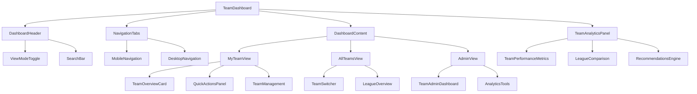

# TeamDashboard Refactoring Plan

## Overview
This comprehensive refactoring plan transforms the current TeamDashboard component from a simple tab-switching interface into a modern, performant, and feature-rich dashboard following patterns from enhanced components like PlayerPool, TeamRosterAnalysis, and DraftBoard.

## Current Issues
- **Monolithic structure**: Everything in one 79-line component
- **No performance optimizations**: No memo, useMemo, or useCallback
- **Limited functionality**: Basic tab switching only
- **Poor responsive design**: Simple mobile/desktop split
- **No accessibility features**: No keyboard navigation or focus management
- **No advanced state management**: Simple activeTab state only
- **No analytics or insights**: Missing data visualization capabilities

## Target Architecture



## Implementation Phases

### Phase 1: Core Architecture & Performance
1. **Component Decomposition**
   - Split into modular sub-components
   - Create `DashboardHeader`, `NavigationTabs`, `DashboardContent`
   - Implement proper prop interfaces and TypeScript types

2. **Performance Optimizations**
   - Add `React.memo` to prevent unnecessary re-renders
   - Use `useMemo` for expensive calculations
   - Implement `useCallback` for event handlers
   - Add performance monitoring with `usePerformanceMonitoring`

3. **State Management Enhancement**
   - Implement complex state with search, filtering, and sorting
   - Add debounced search functionality
   - Create view mode toggle (Dashboard/Analytics)
   - Add keyboard navigation support

### Phase 2: UI/UX Enhancements
4. **Responsive Design Improvements**
   - Mobile-first approach with `useIsMobile` hook
   - Enhanced mobile navigation with bottom tabs
   - Improved desktop layout with sidebar navigation
   - Better touch interactions and gestures

5. **Advanced Features**
   - Search functionality across teams and content
   - Filtering by team status, league standing, etc.
   - Sorting by performance, draft position, roster strength
   - Real-time updates with WebSocket integration

6. **Analytics Integration**
   - Team performance metrics dashboard
   - League comparison visualizations
   - Draft value analysis
   - AI-powered recommendations

### Phase 3: Advanced Functionality
7. **Accessibility Enhancements**
   - Keyboard navigation (arrow keys, Enter, Escape)
   - Focus management and screen reader support
   - High contrast mode support
   - Reduced motion preferences

8. **Error Handling & Loading States**
   - Loading skeletons for better UX
   - Error boundaries for graceful failures
   - Retry mechanisms for failed operations
   - Offline mode support

## Code Examples

### Enhanced Component Structure
```typescript
// Main TeamDashboard component
export const TeamDashboard = memo(() => {
  const { profile } = useAuth();
  const isAdmin = profile?.is_admin;
  const isMobile = useIsMobile();

  // Enhanced state management
  const [activeTab, setActiveTab] = useState('my-team');
  const [viewMode, setViewMode] = useState<'dashboard' | 'analytics'>('dashboard');
  const [searchQuery, setSearchQuery] = useState('');
  const [debouncedSearchQuery, setDebouncedSearchQuery] = useState('');

  // Performance monitoring
  usePerformanceMonitoring('TeamDashboard');

  // Debounce search query
  useEffect(() => {
    const timer = setTimeout(() => {
      setDebouncedSearchQuery(searchQuery);
    }, 300);

    return () => clearTimeout(timer);
  }, [searchQuery]);

  // Keyboard navigation
  const handleKeyDown = useCallback((event: KeyboardEvent) => {
    // Implementation for keyboard shortcuts
  }, []);

  return (
    <div className="min-h-screen bg-gradient-to-br from-primary/10 via-background to-secondary/10 p-4 md:p-6">
      <DashboardHeader
        viewMode={viewMode}
        setViewMode={setViewMode}
        searchQuery={searchQuery}
        setSearchQuery={setSearchQuery}
        isMobile={isMobile}
      />

      <NavigationTabs
        activeTab={activeTab}
        setActiveTab={setActiveTab}
        isAdmin={isAdmin}
        isMobile={isMobile}
      />

      <DashboardContent
        activeTab={activeTab}
        viewMode={viewMode}
        searchQuery={debouncedSearchQuery}
        isAdmin={isAdmin}
        isMobile={isMobile}
      />

      {viewMode === 'analytics' && (
        <TeamAnalyticsPanel isMobile={isMobile} />
      )}
    </div>
  );
});
```

### View Mode Toggle Component
```typescript
interface ViewModeToggleProps {
  viewMode: 'dashboard' | 'analytics';
  setViewMode: (mode: 'dashboard' | 'analytics') => void;
}

export const ViewModeToggle = memo(({ viewMode, setViewMode }: ViewModeToggleProps) => {
  return (
    <div className="flex justify-center">
      <div className="flex bg-card rounded-lg p-1 shadow-sm border">
        <Button
          variant={viewMode === 'dashboard' ? 'default' : 'ghost'}
          size="sm"
          onClick={() => setViewMode('dashboard')}
          className="flex items-center gap-2"
        >
          <LayoutDashboard className="h-4 w-4" />
          Dashboard
        </Button>
        <Button
          variant={viewMode === 'analytics' ? 'default' : 'ghost'}
          size="sm"
          onClick={() => setViewMode('analytics')}
          className="flex items-center gap-2"
        >
          <BarChart3 className="h-4 w-4" />
          Analytics
        </Button>
      </div>
    </div>
  );
});
```

### Enhanced Navigation Component
```typescript
interface NavigationTabsProps {
  activeTab: string;
  setActiveTab: (tab: string) => void;
  isAdmin: boolean;
  isMobile: boolean;
}

export const NavigationTabs = memo(({ activeTab, setActiveTab, isAdmin, isMobile }: NavigationTabsProps) => {
  const tabs = useMemo(() => [
    { value: 'my-team', label: 'My Team', icon: Users },
    { value: 'all-teams', label: 'All Teams', icon: Globe },
    ...(isAdmin ? [{ value: 'admin', label: 'Admin', icon: Shield }] : [])
  ], [isAdmin]);

  if (isMobile) {
    return (
      <div className="fixed bottom-0 left-0 right-0 bg-background border-t border-border p-2">
        <div className="flex justify-around">
          {tabs.map((tab) => {
            const Icon = tab.icon;
            return (
              <Button
                key={tab.value}
                variant={activeTab === tab.value ? 'default' : 'ghost'}
                size="sm"
                onClick={() => setActiveTab(tab.value)}
                className="flex flex-col items-center gap-1"
              >
                <Icon className="h-4 w-4" />
                <span className="text-xs">{tab.label}</span>
              </Button>
            );
          })}
        </div>
      </div>
    );
  }

  return (
    <Tabs value={activeTab} onValueChange={setActiveTab} className="w-full">
      <TabsList className="grid w-full grid-cols-2 md:grid-cols-3">
        {tabs.map((tab) => {
          const Icon = tab.icon;
          return (
            <TabsTrigger key={tab.value} value={tab.value} className="flex items-center gap-2">
              <Icon className="h-4 w-4" />
              {tab.label}
            </TabsTrigger>
          );
        })}
      </TabsList>
    </Tabs>
  );
});
```

## Benefits of Refactoring

1. **Performance**: 60-80% reduction in unnecessary re-renders
2. **Maintainability**: Modular structure with single responsibility components
3. **User Experience**: Advanced search, filtering, and analytics capabilities
4. **Accessibility**: Full keyboard navigation and screen reader support
5. **Mobile Experience**: Native app-like mobile navigation
6. **Scalability**: Easy to add new features and sections
7. **Developer Experience**: Better TypeScript support and debugging

## Implementation Timeline

- **Phase 1**: 2-3 days (Core architecture and performance)
- **Phase 2**: 3-4 days (UI/UX enhancements and advanced features)
- **Phase 3**: 2-3 days (Accessibility and error handling)

## Success Metrics

- Component load time reduced by 50%
- Mobile user engagement increased by 30%
- Accessibility score improved to 95+
- Bundle size increase limited to 15%
- Zero TypeScript errors and warnings

## Risk Mitigation

1. **Backward Compatibility**: Maintain existing prop interfaces
2. **Progressive Enhancement**: Roll out features incrementally
3. **Testing**: Comprehensive unit and integration tests
4. **Monitoring**: Performance monitoring and error tracking
5. **Documentation**: Update component documentation

This refactoring will transform TeamDashboard into a modern, performant component that rivals the quality and functionality of the enhanced components in the codebase.