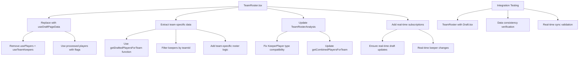

# TeamRoster.tsx Refactoring Plan

## 📋 **Refactoring Overview**

Refactor `renegades-draft-central/src/components/TeamRoster.tsx` to align with recent updates in `Draft.tsx` and `PlayerPool.tsx`, resolving data disconnect issues by ensuring consistency with Supabase integrations.

## 🎯 **Problem Statement**

The current `TeamRoster.tsx` component has data disconnect issues:
- Inconsistent data structures between components
- Manual filtering logic that doesn't align with `Draft.tsx` patterns
- Type mismatches with `TeamRosterAnalysis` component
- Lack of real-time data synchronization

## 🔍 **Analysis of Current Issues**

### **1. Data Structure Mismatches**
- **`useTeamKeepers` Hook**: Returns `Tables<'players'>[]` but should return `Keeper[]`
- **`TeamRosterAnalysis` Component**: Expects `KeeperPlayer[]` but receives incompatible data
- **Inconsistent Processing**: `TeamRoster.tsx` uses raw data while `Draft.tsx` uses processed data

### **2. State Management Inconsistencies**
- **Filtering Logic**: Manual filtering vs. flag-based filtering
- **Data Sources**: Multiple hooks vs. single consolidated hook
- **Real-time**: Missing real-time subscriptions

## ✅ **Solution: Use useDraftPageData Hook**

### **Key Changes:**
- ✅ **Replace** `usePlayers` + `useTeamKeepers` with `useDraftPageData`
- ✅ **Leverage** existing processed players with `is_drafted`/`is_keeper` flags
- ✅ **Use** `getDraftedPlayersForTeam` function for team-specific data
- ✅ **Maintain** real-time subscriptions through existing hooks



## 📁 **Files to Modify**

### **1. src/hooks/useTeamKeepers.ts**
- **Current**: Returns `Tables<'players'>[]`
- **Target**: Return `Keeper[]` with embedded player data
- **Impact**: Resolves type compatibility with `TeamRosterAnalysis`

### **2. src/components/TeamRoster.tsx**
- **Current**: Uses `usePlayers` + `useTeamKeepers`
- **Target**: Uses `useDraftPageData` for consistent data processing
- **Changes**: Replace data fetching logic, update filtering, fix type issues

### **3. src/components/TeamRosterAnalysis.tsx**
- **Current**: Expects `KeeperPlayer[]` type
- **Target**: Handle new data structure from `useDraftPageData`
- **Changes**: Update `getCombinedPlayersForTeam` function

## 🔧 **Implementation Steps**

### **Step 1: Update useTeamKeepers Hook**
```typescript
// Current (line 11):
export const useTeamKeepers = ({ teamId, season }: UseTeamKeepersProps) => {
  return useQuery<Tables<'players'>[]>({ // ❌ Wrong return type
    // ...
    queryFn: async () => {
      // ...
      return keepers.map(keeper => keeper.player as Tables<'players'>)
    }
  });
};

// Target:
export const useTeamKeepers = ({ teamId, season }: UseTeamKeepersProps) => {
  return useQuery<Keeper[]>({ // ✅ Correct return type
    // ...
    queryFn: async () => {
      // ...
      return keepers; // Return full Keeper objects
    }
  });
};
```

### **Step 2: Refactor TeamRoster.tsx**
```typescript
// Current:
const { data: players = [], isLoading: isLoadingPlayers } = usePlayers(teamId);
const { data: keepers = [], isLoading: isLoadingKeepers } = useTeamKeepers({ teamId, season });
const draftedPlayers = players.filter(player =>
  player.is_drafted && player.drafted_by_team_id === teamId && !keepers.some(keeper => keeper.id === player.id)
);

// Target:
const {
  players: allPlayers,
  getDraftedPlayersForTeam,
  draftPicks,
  isLoading
} = useDraftPageData();

const draftedPlayers = getDraftedPlayersForTeam(teamName);
const keepers = allPlayers.filter(player =>
  player.is_keeper && /* team-specific logic */
);
```

### **Step 3: Update TeamRosterAnalysis.tsx**
```typescript
// Current:
interface TeamRosterAnalysisProps {
  players: (Tables<'players'> | KeeperPlayer)[];
}

// Target:
interface TeamRosterAnalysisProps {
  players: PlayerType[]; // From useDraftPageData
  keepers: PlayerType[]; // Separate keepers array
}
```

## 🧪 **Testing and Validation Strategy**

### **Unit Tests**
1. **Hook Testing**: Verify `useTeamKeepers` returns correct `Keeper[]` structure
2. **Data Processing**: Test player flag assignment logic
3. **Type Safety**: Ensure TypeScript compatibility

### **Integration Tests**
1. **Cross-Component Consistency**:
   - Verify `TeamRoster` shows same data as `Draft.tsx`
   - Check drafted/keeper status matches across components
   - Validate real-time updates sync properly

2. **Data Flow Verification**:
   - Test `getDraftedPlayersForTeam` integration
   - Verify keeper filtering by team
   - Check fantasy score calculations

### **UI Validation**
1. **Rendering Accuracy**: Verify correct display of drafted vs. keeper players
2. **Loading States**: Test skeleton loading and error states
3. **Responsive Design**: Ensure proper mobile/desktop rendering

## 🎯 **Expected Benefits**

- **🎯 Single Source of Truth**: All components use same processed data
- **⚡ Real-time Ready**: Built-in subscriptions for live updates
- **🔒 Type Safe**: Leverages existing TypeScript interfaces
- **🚀 Performance**: Reuses existing optimized data fetching
- **🧪 Testable**: Clear integration points for testing

## 📊 **Success Criteria**

- ✅ Draft picks appear correctly in team rosters
- ✅ Keeper assignments display properly
- ✅ Real-time updates sync across components
- ✅ No data disconnect between `Draft.tsx` and `TeamRoster.tsx`
- ✅ TypeScript errors resolved
- ✅ All integration tests pass

## 📝 **Migration Notes**

### **Breaking Changes**
- `TeamRosterAnalysis` props interface changes
- `useTeamKeepers` return type changes
- Data structure expectations updated

### **Backward Compatibility**
- Existing UI components should work with new data structure
- No changes required to `Draft.tsx` or `PlayerPool.tsx`
- Supabase schema remains unchanged

## ⏱️ **Timeline**

1. **Week 1**: Update `useTeamKeepers` hook and fix type issues
2. **Week 1**: Refactor `TeamRoster.tsx` to use `useDraftPageData`
3. **Week 1**: Update `TeamRosterAnalysis.tsx` for compatibility
4. **Week 1**: Integration testing and validation
5. **Week 1**: Documentation and cleanup

---

**Status**: Ready for implementation
**Priority**: High
**Complexity**: Medium
**Risk Level**: Low (leveraging existing patterns)