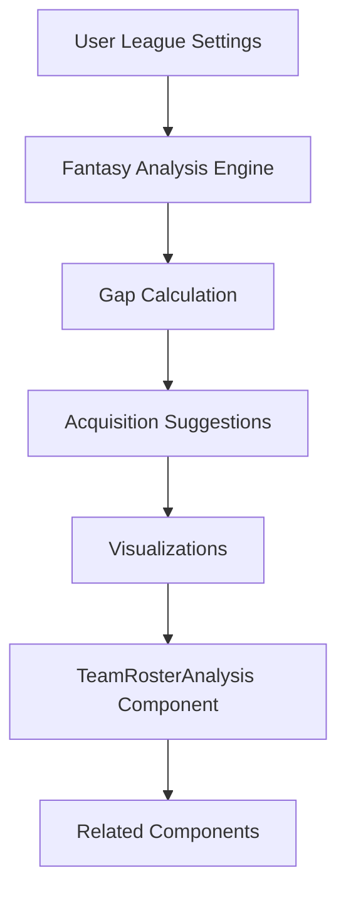

# TeamRosterAnalysis Fantasy Refactor Plan

## Overview

Transform the `TeamRosterAnalysis` component from a basic position-based analysis to a comprehensive fantasy sports analysis tool that provides actionable insights for fantasy basketball management.

## Current State Analysis

The current `TeamRosterAnalysis` component provides:
- Basic position counting (PG, SG, SF, PF, C)
- Simple fantasy score calculations
- Basic positional needs identification

## Target State

### Core Features
1. **Fantasy Metrics Focus**: Shift analysis to key fantasy stats (points, rebounds, assists, steals, blocks, 3PM, turnovers)
2. **Gap Analysis**: Identify statistical deficiencies against league averages and optimal thresholds
3. **Acquisition Suggestions**: Recommend players to target for filling gaps
4. **Interactive Visualizations**: Charts and heatmaps for stat comparisons
5. **Benchmarking**: Compare against rival teams and league standards
6. **Dynamic Thresholds**: User-defined league settings integration

### Enhanced Analysis Categories

#### Statistical Categories
- **Points Per Game (PPG)**: Offensive production analysis
- **Rebounds Per Game (RPG)**: Rebounding strength assessment
- **Assists Per Game (APG)**: Playmaking evaluation
- **Steals Per Game (SPG)**: Defensive disruption measurement
- **Blocks Per Game (BPG)**: Rim protection analysis
- **3-Pointers Made (3PM)**: Three-point shooting evaluation
- **Turnovers Per Game (TPG)**: Ball security assessment

#### Fantasy Efficiency Metrics
- **Fantasy Points Per Game**: Total fantasy production
- **Value Over Replacement Player (VORP)**: Player value comparison
- **True Shooting Percentage**: Overall shooting efficiency
- **Player Efficiency Rating (PER)**: Comprehensive player rating

## Implementation Plan

### Phase 1: Core Refactoring

#### 1.1 Enhanced Data Structure
```typescript
interface FantasyGap {
  category: string;
  currentValue: number;
  targetValue: number;
  gap: number;
  severity: 'critical' | 'moderate' | 'minor';
  priority: number;
}

interface AcquisitionSuggestion {
  playerId: string;
  playerName: string;
  primaryBenefit: string;
  projectedImpact: number;
  rationale: string;
}

interface FantasyAnalysis {
  gaps: FantasyGap[];
  strengths: string[];
  suggestions: AcquisitionSuggestion[];
  benchmarks: {
    leagueAverage: number;
    teamRank: number;
    percentile: number;
  };
}
```

#### 1.2 Core Utility Functions
- `calculateFantasyGaps()`: Compare team stats vs. league averages
- `generateAcquisitionSuggestions()`: Recommend players based on gaps
- `calculateFantasyEfficiency()`: Compute advanced fantasy metrics
- `getLeagueBenchmarks()`: Dynamic league comparison data

### Phase 2: Component Architecture

#### 2.1 Main Component Structure
```typescript
// Fantasy-focused sections
- Fantasy Overview Dashboard
- Statistical Gap Analysis
- Acquisition Recommendations
- Interactive Visualizations
- Performance Benchmarks
```

#### 2.2 Sub-components
- `FantasyMetricsCard`: Individual stat analysis
- `GapAnalysisChart`: Visual gap representation
- `AcquisitionSuggestionsList`: Player recommendations
- `BenchmarkComparison`: League positioning
- `InteractiveStatHeatmap`: Visual stat comparison

### Phase 3: Visualizations & Interactions

#### 3.1 Chart Types
- **Radial/Spider Chart**: Multi-stat comparison
- **Heatmap**: Stat category strengths/weaknesses
- **Bar Charts**: Gap visualization
- **Progress Bars**: Achievement vs. targets

#### 3.2 Interactive Features
- **Drill-down**: Click stats for detailed breakdowns
- **Filtering**: Focus on specific categories
- **Threshold Adjustment**: Custom league settings
- **Player Comparison**: Side-by-side analysis

### Phase 4: Integration & Consistency

#### 4.1 Related Components Update
- **TeamRostersTab**: Enhanced roster insights
- **TeamStrengthsWeaknesses**: Unified analysis approach
- **RosterComparison**: Consistent fantasy metrics

#### 4.2 Data Flow


## Technical Implementation Details

### 5.1 Data Sources Integration
- **Player Statistics**: Enhanced stats from existing player data
- **League Averages**: Dynamic calculation from all teams
- **User Settings**: Custom thresholds and scoring rules
- **External APIs**: Live stat updates (future enhancement)

### 5.2 Performance Optimizations
- **Memoization**: Cache expensive calculations
- **Lazy Loading**: Load visualizations on demand
- **Efficient Queries**: Optimized database queries
- **Responsive Design**: Mobile-first approach

### 5.3 Error Handling
- **Graceful Degradation**: Fallback for missing data
- **Loading States**: Smooth user experience
- **Error Boundaries**: Component-level error handling
- **Data Validation**: Ensure data integrity

## Success Criteria

### 6.1 User Experience
- ✅ Clear fantasy-focused insights
- ✅ Actionable recommendations
- ✅ Intuitive visualizations
- ✅ Mobile responsive

### 6.2 Technical Excellence
- ✅ Consistent data flow
- ✅ Optimized performance
- ✅ Robust error handling
- ✅ Maintainable code structure

### 6.3 Feature Completeness
- ✅ All fantasy metrics covered
- ✅ Gap analysis implemented
- ✅ Acquisition suggestions
- ✅ Interactive visualizations
- ✅ Benchmarking capabilities

## Migration Strategy

### 7.1 Phased Rollout
1. **Phase 1**: Core fantasy metrics replacement
2. **Phase 2**: Gap analysis and suggestions
3. **Phase 3**: Visualizations and interactions
4. **Phase 4**: Related component updates

### 7.2 Backward Compatibility
- Maintain existing prop interfaces
- Gradual feature rollout
- A/B testing capabilities
- Rollback procedures

## Risk Mitigation

### 8.1 Development Risks
- **Data Complexity**: Implement robust validation
- **Performance Impact**: Monitor and optimize
- **UI Complexity**: User testing and feedback

### 8.2 Business Risks
- **User Adoption**: Clear value proposition
- **Feature Overload**: Prioritized, essential features first
- **Technical Debt**: Clean, maintainable code

## Timeline & Milestones

### 9.1 Development Phases
- **Week 1**: Core refactoring and data structures
- **Week 2**: Fantasy metrics implementation
- **Week 3**: Visualizations and interactions
- **Week 4**: Integration and testing
- **Week 5**: Optimization and polish

### 9.2 Key Deliverables
1. Enhanced `TeamRosterAnalysis` component
2. Updated related components
3. Comprehensive test coverage
4. Documentation and user guides
5. Performance monitoring setup

## Next Steps

1. ✅ Create detailed implementation plan
2. ⏳ Review and approve plan
3. ⏳ Begin implementation
4. ⏳ Testing and validation
5. ⏳ Deployment and monitoring

---

**Are you satisfied with this comprehensive refactoring plan?** Would you like me to make any adjustments before we proceed with the implementation?